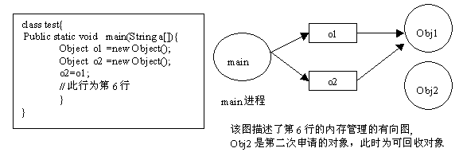
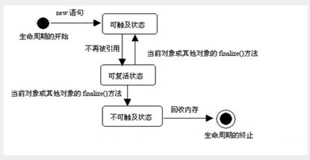

# Java 内存泄漏
190523，RSS给我推送了新的内容，扫了几眼对其中几篇文章挺感兴趣的，其中一篇出自掘金——[纳尼，Java 存在内存泄泄泄泄泄泄漏吗？
](https://juejin.im/post/5ce5d750f265da1b6a346b91)，至此记录阅读心得吧。其次，还涉及以下几篇文章：
- [IBM-Java的内存泄漏](https://www.ibm.com/developerworks/cn/java/l-JavaMemoryLeak/index.html)
- [GC机制和内存泄漏](https://lovoedu.gitee.io/javablog/2017/08/27/20170827/)

### 什么是内存泄漏

之所以感兴趣是以前没有具体的看过jvm内存泄漏（Memory Leak）的问题，不同于内存溢出（OOM），OOM是指程序申请内存空间但没有足够大的内存分配给它使用，Memory Leak是指程序申请内存空间后无法正确释放已申请的内存（具体一点就是不再使用的对象或变量一直占着内存空间）。虽然一两次内存泄漏问题不大，但长期积累内存也会被耗光，所以内存泄漏可能引起内存溢出

### 内存泄漏发生的情景

首先要明白为啥会发生内存泄漏，内存的分配由程序完成，内存的回收由GC自动完成。GC又是如何判断对象死亡可以被回收的？一种是引用计数法（存在相互引用的问题），另一种就是现在多被使用的可达性分析法。如图，由main进程为顶点开始的有向图，代表jvm内存的分配，第六行时o2由Obj2指向了Obj1，此时顶点到Obj2不可达，GC可以判断Obj2可回收。

> 图片引自：www.ibm.com/developerworks/cn/java/l-JavaMemoryLeak/1.gif

上面的例子再具体一点需要讲清**什么是顶点和可达**。
可见《深入理解java虚拟机》，顶点就是指GC Roots对象，有四种对象属于GC Roots对象

- 方法区中类静态属性引用的对象
- 方法区中常量引用的对象
- 虚拟机栈中引用的对象
- 本地方法栈中JNI[即一般说的Native]引用的对象

**可达**就是有从GC Roots对象到当前对象的引用链
所以内存泄漏专业点说就是不再被使用，但是仍就可达的对象
> 
> - 可触及状态：程序中还有变量引用，那么此对象为可触及状态。
> - 可复活状态：当程序中已经没有变量引用这个对象，那么此对象由可触及状态转为可复活状态。CG线程将在一定的时间准备调用此对象的finalize方法（finalize方法继承或重写子Object），finalize方法内的代码有可能将对象转为可触及状态，否则对象转化为不可触及状态。
> - 不可触及状态：只有当对象处于不可触及状态时，GC线程才能回收此对象的内存。

- 长生命周期的对象持有短生命周期对象的引用造成内存泄漏

如下，object对象申明后只在method1方法中使用，但只有当Simple对象被释放后才会释放object对象。如果method1方法短时间内大量调用就会创建大量object对象，可能造成内存泄漏。解决方法就是method1方法内object使用完后置空`object=null`
```java
public class Simple {
    Object object;
    public void method1(){
        object = new Object();
        //...其他代码
        //object = null;//释放object
    }
}
```

- 集合中内存泄漏

如下，对象o加入了Vector中，即使后面`o=null`，但Vector中有该对象的引用，所以o并没有释放，只是引用对象o指向了null。如若要释放该对象，必须从 Vector 中删除，最简单的方法就是将 Vector 对象设置为 null
```java
Vector v=new Vector(10);
for (int i=1;i<100; i++)
{
    Object o=new Object();
    v.add(o);
    o=null; 
}
```
- Java常见的内存泄漏
  - 数组使用的时候内存泄漏。
  - 文件读取，数据库连接，网络连接，IO连接等没有显示调用close关闭，会导致内存泄露
  - 监听器的使用，在释放对象的同时没有相应删除监听器的时候也可能导致内存泄露
  - 内部类和外部模块的引用

摆一个数组使用造成内存泄漏的例子，用数组实现堆栈
```java
//出栈方法，elements是数组
//这里size是栈中对象的个数
public Object pop(){
  if(size==0)
    throw new EmptyStackException();
  return elements[--size];
}
```
没错，这里只是size减了一，但数组中还是保有被出栈的Object对象的引用，该对象就不会被回收。如下是修改后的代码
```java
public Object pop(){
  if(size==0)
    throw new EmptyStackException();
  Object o = elements[--size];
  elements[size] = null;
  return o;
}
```
### 检测内存泄漏

> 最后一个重要的问题，就是如何检测Java的内存泄漏。目前，我们通常使用一些工具来检查Java程序的内存泄漏问题。市场上已有几种专业检查Java内存泄漏的工具，它们的基本工作原理大同小异，都是通过监测Java程序运行时，所有对象的申请、释放等动作，将内存管理的所有信息进行统计、分析、可视化。开发人员将根据这些信息判断程序是否有内存泄漏问题。这些工具包括Optimizeit Profiler，JProbe Profiler，JinSight , Rational 公司的Purify等。

IBM这篇文章给出了 Optimizeit Profiler 的使用介绍：<https://www.ibm.com/developerworks/cn/java/l-JavaMemoryLeak/index.html>

***
可以进一步阅读知乎上的一个讨论：[这段代码有没有正确释放堆栈空间？](https://www.zhihu.com/question/37413173)