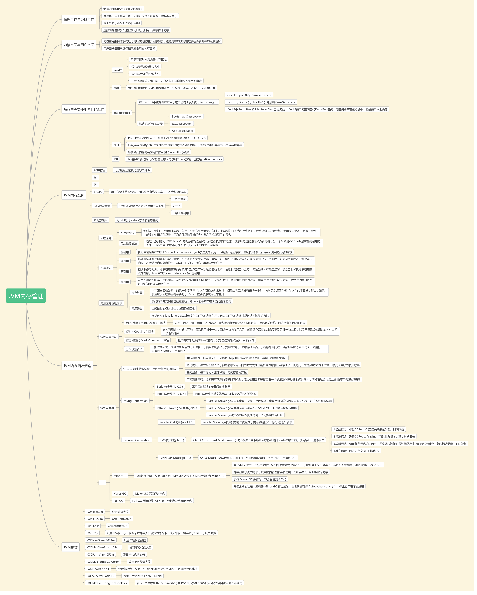

# README
## 如何阅读源码
今天逛知识星球，看到一个"如何看源码的讨论"，转一下：
> vinoyang答
> 这是一个好问题。我个人从2016年初开始看Flink的源码，也经历了两个阶段。第一个阶段，也是那种盲目地硬读，直接就着代码实现看，效率很底下。直到第二个阶段，才慢慢摸索出了一些门路。总结一下，大概这几个关键词：抓大放小，自顶向下，善用工具，交流思考。
>
>自顶向下：有点抓大放小的意思，但还是有区别的，这个更宏观一点。这个以我们所看的项目的层次结构为主线。通过IDE将所有层级收缩，然后依次展开，先是module列表，通过这一层，我们可以看到flink项目中大致包含的主要模块。了解后，先别急着展开下一层，先去搞清楚每个模块的作用，在架构图中的层次，事实上Flink官网有这幅图的。了解清楚之后，我们再挑选最感兴趣或者最容易的模块入手。开始展开到src下的java/scala层级。我们又看到了一个最顶层的package列表。还是一样，它展示了这个module的主要component（分支）的列表。这个时候，你应该心中有数，他们各自的作用，各自如何协作，这相当于这个模块内部的顶层设计，我们先要把它搞懂，因为搞懂它看起来才事半功倍，官网应该也有资料去帮你达到这个目的。当你对每个component都有所了解之后，去找这个module的入口方法，然后从它的入口类进入，利用下面提到的抓大放小的思想去看多个component方法调用的编排流程图。当然不一定所有的component调用都体现在入口类中，对于这些类我们可以应用第三个技巧。
>
>抓大放小：任何时候当你还没有足够了解一个东西的时候，不要纠结于实现的细节。不要一下子去看检查点里或者StreamTask里的方法中的实现细节。从某个入口类进去，一般它都是很多类方法调用的编排，这个时候先把编排看懂，千万不要看到一个调用，就跟进去看它的细节。先把整个编排的流程图刻在脑子里再说。
>
>善用工具：这一步因人而异，看个人喜好，我只用Intellij IDEA，所以我只谈这个工具，其他工具应该多多少少能实现我们希望的目标。我们需要idea中两个强大的功能：展示一个package下所有类的UML类继承关系图。这非常便于我们去了解哪些内部component的整体结构。当然在了解的时候，我们还是要遵循第二个技巧，抓大放小，先从接口看起。另一个功能是，查看一个方法的调用关系，在菜单“Navigate” -> “Call Hierarchy”（选中一个方法）。可以查Caller或Callee，这两种链条，这非常有益于我们梳理调用链的关系。
>
>交流思考：当你在思路上无法突破或者实在理解不了某个实现的意图的时候，可能是自己的知识面上存在缺陷，需要与其他人交流来进行思想上的碰撞或特定知识的补充。

## JVM内存管理
也是从星球上拔下来的，一个球友分享的，我觉得总结的不错

## git 合并冲突解决
git冲突解决

 

 

冲突的产生几乎是不可避免的，当冲突产生时你需要将一个分支中的更改与另一个分支中的更改合并，对应git的命令为 git merge NAME ，一般过程如下：

找到HEAD和NAME的一个共同祖先(common base)

尝试将这些NAME到共同祖先之间的修改合并到HEAD上

新创建一个merge commit对象，包含所有的这些变更内容

HEAD指向这个新的mergecommit

git将会保证这个过程改动不会丢失，另外一个命令你可能会比较熟悉，那就是 git pull 命令，git pull 命令实际上包含了 git merge 的过程，具体过程为：

git fetch REMOTE

git merge REMOTE/BRANCH

和 git push一样，有的时候需要先设置 "tracking"(-u) ，这样可以将本地和远程的分支一一对应。

如果每次merge都如此顺利，那肯定是非常完美的，但有时候你会发现在合并时产生了冲突文件，这时候也不用担心，如何处理冲突的简要介绍如下：

冲突只是因为git不清楚你最终要合并后的文本是什么样子，这是很正常的情况

产生冲突时，git会中断合并操作，并指导你解决好所有的冲突文件

打开你的冲突文件，找到 <<<<<<< ，这是你需要开始处理冲突的地方，然后找到=======，等号上面的内容是HEAD到共同祖先之间的改动，等号下面是NAME到共同祖先之间的改动。用 git mergetool 通常是比较好的选择，当然现在大多数IDE都集成了不错的冲突解决工具

当你把冲突全部解决完毕，请用 git add . 来暂存这些改动吧

最后进行git commit，如果你想放弃当前修改重新解决可以使用 git merge --abort ，非常方便

当你完成了以上这些艰巨的任务，最后 git push 吧！