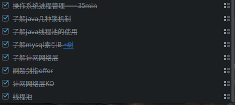
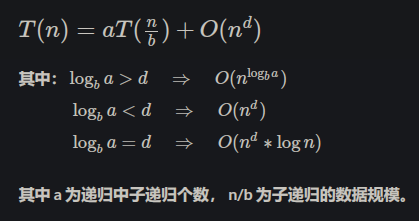

## 前言

放弃考研的我，一是感觉自己技术面还算广，二是觉得或许自己并不适合搞研究，三是太久没刷数学题了写李永乐的全书头疼，故放弃。但遗憾的是可能会错过三四月的春招了（感觉自己还是菜，不敢轻易上），趁现在还不算太晚——2.28，现在开始准备秋招吧

这个项目将记录我这几月来每日看了些啥，准备了些啥，以及将来面试经历吧

至于从业方向，意愿是大数据方向（本科专业是大数据专业方向）。了解C++、Java、Python、Scala，学过爬虫、Web (Django)、数据分析、机器学习、大数据几个组件以及一点基本的前端内容，日常是Linux下开发的所以会一些linux命令和shell脚本，不会java web那些

目前还在看一些前人的经验贴，了解校招可能会考写啥，主要是逛逛牛客网。其次是看github上的几个面试的项目，收纳在此：

- **《技术面试必备基础知识》** https://github.com/CyC2018/CS-Notes
- **《Java学习+面试指南》** https://github.com/Snailclimb/JavaGuide

## 历程

### 2-28日：每个人都在努力都在奋不顾身，不是只有你受尽委屈

- 计划一星期复习java基础
  - 看完了《核心技术卷一》的一到四章，记录见：[读书](https://github.com/josonle/Interview-Preparation/tree/master/%E8%AF%BB%E4%B9%A6)
- 看了下B站上的左程云的算法课——排序
  - 找到了几个算法相关资源
    - Leetcode刷题
    - 极客时光的算法通过面试40讲和左程云的算法课
    - 书籍：《算法》和《剑指offer》
- 打算抽空看下csapp这本书，系统过下计算机理论
  - 图书馆这本书被借光了，找了本电子版的，配我的kindle
- 放松下追剧——韩剧《国王》，挺不错的丧尸片

### 3-01日：天气不错，心情亦嘉

- 计划核心卷五六章
- 剑指offer
- 周五了看下《国王》吧，昨天追了三集，确实不错。脱发男孩继续。。。（我去，掉头发怎么办啊~~~~(>_<)~~~~）
- 待续

### 3-02日：风乍起,合当奋意向人生——《起风了》

- 继续核心卷五六章吧，昨天没看完
- 开了编译原理的课，想着也得花时间，毕竟很重要
  - 借到了《两周自制脚本语言》看看

### 3-04日

- 看书看书，我忍。。。
- 找到一个博主的java提高篇文章，比自己总结的更简洁啊！https://www.cnblogs.com/chenssy/category/525010.html
- 核心卷第七章，涉及异常、错误、日志处理问题，粗略地看了下
- 《两周自制脚本语言》第一二天，敲了两三年代码了，还是第一次了解编程语言是怎么运行的

### 3-05日

- 核心卷第八章，泛型和反射
- 《两周自制脚本语言》第三天
- 看了些算法题和笔试题

### 3-06日：好想要一只哆啦A梦啊

- 核心卷第九章，涉及集合框架了，这里结合网上搜到的一些博客一起看吧。昨晚初步看了下ArrayLIst的源码，东西太多了，时间又紧张
  - 了解了ArrayLIst、LinkedList、Vector，HashSet、TreeSet、LinkedSet
- 回顾了Spark基础，基础名词、核心架构啊、Driver、Executor啊、配置等等
- 打算把年前的spark推荐系统的项目捡起来，有好大一部分没写完
- 继续看算法，排序篇吧

时间很紧了，金三银四，春招开始了，五天后就是腾讯的宣讲会，但自我感觉还没准备好。烦啊，不知道是好好准备秋招还是现在就参与春招。想着有必要参加暑期实习，但感觉面试又没准备好什么，现在为止还在看着java、算法也没刷什么，操作系统、计网、机组那些都没看。看吧，走一步看一步吧。。。唉，生活还要依旧啊。。。

### 3-08日

- 看了sql基础，以及mysql几种存储引擎（InnoDB、MyISAM、Memory等）和索引机制
- 刷了两道算法题
- 无事刷剧。。。

### 3-09日

- 决定参加春招了，更多的是想了解面试、笔试会考什么类容，好准备
- 撰写简历（用MarkDown写的），本以为没什么可写，实际上手也写了两页纸
- 总结回顾下java集合及常考知识点
- 核心卷 java并发、多线程

### 3-11日

- java多线程Lock接口和实现类
  - 多线程内容看的是csdn上的一个[系列博客](https://blog.csdn.net/qq_34337272/article/details/79714196)
- 牛客刷剑指Offer，排序

### 3-12日

- 总结了下Hive，画了个[脑图](http://naotu.baidu.com/file/cdcd76d878f210e43a91b24d4254abed?token=c3839e44e93c9a5e)
- 回顾了下计网的几个知识点——http/https、tcp/udp
  - [http三次握手四次挥手](https://www.cnblogs.com/nevermorewang/p/8906833.html)
  - [HTTPS四次握手过程](http://www.cnblogs.com/lovesong/p/5186200.html) 【强推】
  - [https在每次传输过程中都要先通过ssl握手传输秘钥吗？](https://www.zhihu.com/question/67740663)
  - [SSL和TLS的区别](https://kb.cnblogs.com/page/197396/)
  - [SSL/TSL是那一层的协议？](https://www.jianshu.com/p/5ee027c51af0)
  - 《TCP—UDP理解》原来学习计网时不知道在哪找到的一个大神写的pdf，足够了
- 回顾SparkSQL的DataFrame、DataSet
- 刷题剑指offer的数组模快
- 听了腾讯的宣讲会，感觉现在功力还不行。反正是提前批，等四月中旬是正式招，一个月的样子足以巩固了
- 不过昨天投了七牛云的大数据开发实习岗位，等15号第一批笔试吧

### 3-13日：我就站在布拉格黄昏的广场，在许愿池投下了希望...

- 回顾之前记录下的java核心卷总结

### 3-15日：

- 参加了七牛云的笔试，第一次啊，上手后感觉难度还行吧。不过自己没有准备操作系统，这类题大多都不会
  - 得开始看操作系统了
  - 可能计网掌握的还可以吧，碰到什么TCP/IP、http啥的都能想的起来
- 投了旷视科技、依图科技、快手，用来练练手吧，毕竟才三月半，离四月的大头还有一段时间
- 决定归纳一些笔试面试碰到的题

### 3-16日：一切如旧

- 在Linux上破解安装了XMind8，准备用脑图的形式归纳知识点
- 归纳了集合类的脑图

### 3-18日

- 投了斗鱼，还不知道上次七牛如何，估计凉凉啊。其他简历也没响应，hhh

### 3-19日：难过啊

投了这么多家，没有反馈，好比泥牛入海啊，虽然没到笔试时间，但一点回音都没有。看到有些人可能早早确定工作，年前就开始准备了，现在都有offer到手了。唉，真的是让人心烦啊

难过又能怎么办呢？生活不还是要继续吗，看书，敲代码能少得了哪一样呢，对吧

- 整理了java的锁的分类
- 操作系统进程、线程
- mysql索引B+树
- 看了几个linux命令

### 3-20日

干了这些



### 3-21日

总结了下mysql的存储引擎区别和特点，索引分类和使用、优化等等，[——>见这里](https://github.com/josonle/Interview-Preparation/tree/master/%E8%84%91%E5%9B%BE)

### 3-22日

- 手敲二叉搜索树代码
- 操作系统线程管理、CPU调度相关内容
- 《Spark内核设计艺术》耿家安老师的书，也是群友推荐的，今天上午看了前两章确实不错
- 周五了，看部电影放松下吧，\(^o^)/~

### 3-23日

- 总结下并发synchronized、ReentrantLock、线程池相关问题
- 《Spark内核设计的艺术》

### 3-25日

- 内推了度小满金融的java岗，投了360数据开发岗（[笔试4月3号](http://chrcmp.chinahr.com/views/2019-qihu360/introduction_4.html)）
- 明晚斗鱼java大数据笔试

### 3-26日

- <http://www.jyguagua.com/?p=3364> top常用几条命令

- [几个特殊TCP报文及TCP](https://blog.csdn.net/jhcsdb/article/details/44086565)，回顾下滑动窗口为0，full的情况怎么办

- [理解字节序](<http://www.ruanyifeng.com/blog/2016/11/byte-order.html>)

  - 小端字节序，大端字节序。像X86系列都是小端字节序

  > 数值`0x2211`使用两个字节储存：高位字节是`0x22`，低位字节是`0x11`。
  >
  > - **大端字节序**：高位字节在前，低位字节在后，这是人类读写数值的方法。
  > - **小端字节序**：低位字节在前，高位字节在后，即以`0x1122`形式储存。
  >
  > 为什么会有小端字节序？
  >
  > - 答案是，**计算机电路先处理低位字节，效率比较高**，因为计算都是从低位开始的。所以，计算机的内部处理都是小端字节序。
  >
  > - 但是，人类还是习惯读写大端字节序。所以，**除了计算机的内部处理，其他的场合几乎都是大端字节序**，比如网络传输和文件储存

- [lsof命令的几个妙用](<https://blog.51cto.com/xjsunjie/1255661>)

### 3-27日

- 接到了快手面试邀请，电话都没看到，还是过后打回去的（小姐姐人很好说话又好听），没有笔试，定在下周，得好好捋一捋了
  - 有预感进入四月面试陆陆续续要来了

- 读《Java并发编程艺术》

### 3-28日

- 快吃完饭时投了腾讯的java后台开发，没想到过了十来分钟就有面试官给我来电话。一切都是懵的，不过面试官人挺不错的，就是声音有点小，循循善诱聊了50来分钟。心疼啊，第一次面试，感觉自己真的是菜。但好像是简历面，问的挺广的但不算很深，最后问他说看我做的项目给我推到大数据那里去。下面列几个问题吧

  - 为什么计算机移位运算比加法快？（不会，一时语塞）
  - 如何保证分布式系统副本完整性、一致性？（类似的）

  > 我临时想的，以hdfs心跳检测为例，比较每个块的校验码之类的，答得稀里糊涂的。他说可以，但是怎么处理校验码可能相同但数据不同的情况？我不会，/(ㄒoㄒ)/~~

  - 列一个场景，根据学生成绩（满分150）排序，从6000人次怎么排？600万人次怎么排？

    > 最初6000人次，我说直接快排O(nlogn)。600万人次，我说可以像数据库那样用B+树结构插入数据，因为叶子节点是有序的，而且时间复杂度O(logn)。他问还有什么方法？我又提出可以分桶，通过重写hashCode方法把一个区间内的数放在一起，桶内在排序。他说很接近了，还**一直强调满分150**。后来问他，说是通过基数排序，因为有150这个范围。/(ㄒoㄒ)/~~，我不知道

  - 还有一些问题，像十亿个数选出前100个数（TopK)，TCP安全如何保证？拥塞控制怎么做？HashMap怎么扩容的？线程安全怎么做到？抓过包吗？（我说通过浏览器抓过包，不是他想要的，又说用过wireshark。又问linux下用过抓包工具吗？没，这个问题就跳过了）。大致这些吧，想不起来了

- 最近几天计划

  - JVM类加载机制、GC垃圾回收算法——CMS之类的——好好看一下
  - JUC下几个类好好看一下
  - 好好回顾下HDFS架构、Yarn架构、Hive、Spark Core等，之前写的MR项目、Spark项目

### 3-29日

- 着重了解了下线程池原理，几个参数如何设置

  - [ThreadPoolExecutor策略配置以及应用场景 - ChanningBJ  ](https://segmentfault.com/a/1190000008394155)
  - [更好的使用 JAVA 线程池 - 掘金 ](https://juejin.im/entry/5902e1ddda2f60005df064f5)

- 想了下java该如何设计计数器

  - 不是什么i++问题，要考虑并发(线程竞争、可见性等)，也别想着用volatile关键字修饰（做不到并发，只保证可见性）

  - 通过原子类，像AtomicLong，但在高并发场景下Atomic*类效率很低，又如何解决？（用LongAdder代替AtomicLong，都是JUC并发包下原子类中的类）

    > - **单线程下synchronized效率最高**（当时感觉它的效率应该是最差才对）
    >
    > - AtomicInteger效率最不稳定，**不同并发情况下表现不一样**：短时间低并发下，效率比synchronized高，有时甚至比LongAdder还高出一点，但是高并发下，性能还不如synchronized，不同情况下性能表现很不稳定
    >
    > - LongAdder性能稳定，在各种并发情况下表现都不错，整体表现最好,短时间的低并发下比AtomicInteger性能差一点，长时间高并发下性能最高

  - [Java并发计数器探秘 | 徐靖峰|个人博客 ](https://www.cnkirito.moe/java-concurrent-counter/)

  - [聊聊并发（五）——原子操作的实现原理 ](https://infoq.cn/article/atomic-operation)

- 遇到一个大佬--**占小狼**--，有兴趣可以搜索一波

- 想了下Java 并发会问些什么问题
  - 锁怎么实现？主要是synchronized、ReentrantLock，有的时候会问volatile、读写锁
  - 线程池原理，任务工作的流程细致说一遍（会诱导你说出了）
  - ConcurrentHashMap一定会问，会从HashMap实现原理、线程不安全这个话题切入

- 增加《java 并发编程的艺术》记录（含从其他博客看到的知识点）
- [java 中的锁 -- 偏向锁、轻量级锁、自旋锁、重量级锁](https://www.jianshu.com/p/78cf35f01b2f) 可以看一下

### 3-30日

- [《深入理解 Java 内存模型》读书笔记](http://www.54tianzhisheng.cn/2018/02/28/Java-Memory-Model/) ，推荐看这个，《深入理解 Java 内存模型》程晓明 著。引自：[zhisheng](http://www.54tianzhisheng.cn) 
- [MySQL事务隔离级别与锁的关系](https://www.limisky.com/126.html)
- [面试中如何应对Java垃圾回收（GC）的问题](https://icyfenix.iteye.com/blog/715301)
- [20道精选JVM重点面试问题](https://juejin.im/post/5c9ef581f265da308c198bb4)
- [文件系统和数据库是由于什么原因才选择 B 树或 B+ 树建立索引的？](https://www.zhihu.com/question/62406977)

### 3-31日

- 回顾MapReduce-demo、MapReduce的shuffle过程
- 回顾hdfs架构及发展
- 回顾hive架构
- 回顾spark电影推荐项目，spark原理等

### 4-1日

- 上午心情不太好，焦虑ing。中午快午休时，快手hr打来了电话，约加微信等面试
- 快手一面记录

上来就敲代码，前后三道

1. 层次遍历二叉树

2. 实现一个线程安全的单例模式，要求是lazy模式，即首次调用再创建对象

   ```
   
   public class Single{
   
   private static int flag = 0;
   
   private static Single single;
   
   public  static Single get(){
   
   synchronized(this){
   
   if(flag==0){
   
   single = Single();
   
   flag = 1;
   
   }
   
   return single;
   
   }
   
   }
   
   public Single(){}
   
   }
   ```

3.  两个文本文件（每行一个单词），大小均为10G, 我们需要找出在两个文件中都出现过的单词（需要去重）

      限制：有若干台机器，每台机器内存1G，在不同机器间可任意拷贝文件（并忽略拷贝时间），怎样尽快找到结果

      > 先后问了用大数据框架怎么做？（我谈了MR，如何自定义输入格式分片等）不用大数据框架怎么做？（参考MR思想，用HashMap；也说了可以用字典树Trie）


   还有就是问Java基础知识

- HashMap和TreeMap区别

  > 可能大数据中TreeMap用的多吧，想不到会比较这两个Map。一上来我就说了继承的类和接口不同（TreeMap可排序，NavigableMap、SortedMap），然后卡着了，一时想不起这两个有啥好比较的。面试官引导了下都说出来了

- JVM类加载七个过程

- JVM垃圾回收过程

  - 什么时候会GC
  - 什么GC算法
  - 怎么判断那些对象要gc

  > JVM内存模型（新生代、老年代、Metaspace（或永久代））讲一下，新生代空间不足和晋升老年代时GC，分代GC算法有哪些谈了一下。引用计数法和可达性算法讲了下。

- 多线程聊一下，什么场景用

> 我讲了如何创建线程池，用以数据库连接的用法

- 锁讲一下

> 我谈了synchronized的旧版本和新版本优化（引入锁状态、锁升级等），基于JVM讲了一下，比如对象头含有monitor监视器，synchronized对方法和块的不同指令（monitorenter、monitorexit、ACC_SYNCHRONIZED这些）。然后谈了下ReentrantLock，比较了二者，公平非公平、操作更简单灵活（超时获取锁、轮询锁、中断获取锁等）
>
> 面试官又补充问了volatile，我聊了可见性和禁止指令重排

- 大数据
  - MR的Shuffle过程聊一下（原来看过这里的源码，思路比较清晰）
  - 然后就是上面哪个文件的思路
  - MR优化相关

前后一小时左右，自我感觉不错的，问了下面试官，他也说不错，知识面够广，深度也可以。结束时还问了他们组做些什么，用些什么大数据组件


-  快手二面凉凉啊。。。

一面过后四五分钟就打过来了，发起二面。不想聊，一想起就感觉自己菜的不行，先前还挺高兴的/(ㄒoㄒ)/~~

前面聊得挺好的，面试官也说可以。悲剧的是，他提出敲下代码吧。一上来还好，第二题是创建最小堆，第三题是创建图实现拓扑排序。这两题写的我是一头汗啊，最后还是没写出来。平常项目几乎用不到图，所以没有多用心看，堆也是用java封装好的。

结束时候问了下还有面试的可能吗，听意思是婉拒了，/(ㄒoㄒ)/~~。不多说了，翻数据结构去了。。。


### 4-3日

- 看了下递归的时间复杂度怎么求，[大护法]( https://todebug.com/master-formula-of-recursive/)

  

- 手写最小堆、单双链表、BST
- [36进制和10进制转换](https://blog.csdn.net/tiguer/article/details/78113466)

- [一起学Hadoop——TotalOrderPartitioner类实现全局排序](https://www.cnblogs.com/airnew/p/9595385.html)
- [最小堆的实现](https://zhuanlan.zhihu.com/p/37968599)
- [前k小/大算法](https://blog.csdn.net/jeffleo/article/details/64133292) 和 [第k大数据](https://blog.csdn.net/qq_26286193/article/details/80683004) 

### 4-5日

- 腾讯笔试

### 4-6日

- 操作系统总结
- [操作系统重难点总结](https://xiaoxiyouran.github.io/blogger/docs/%E6%93%8D%E4%BD%9C%E7%B3%BB%E7%BB%9F/%E9%9D%A2%E8%AF%95%E5%B8%B8%E9%97%AE/20180829_%E5%B8%B8%E9%97%AE%E9%9D%A2%E8%AF%95%E6%80%BB%E7%BB%93/%E6%93%8D%E4%BD%9C%E7%B3%BB%E7%BB%9F%E9%9D%A2%E8%AF%95%E9%87%8D%E9%9A%BE%E7%82%B9%E6%80%BB%E7%BB%93.html#%E5%9F%BA%E6%9C%AC%E5%88%86%E9%A1%B5%E5%82%A8%E5%AD%98%E7%AE%A1%E7%90%86%E6%96%B9%E5%BC%8F)
- coding
- [*java.util.concurrent*并发包使用指南](https://juejin.im/post/5c89c93bf265da2de71391ec)

### 4-7日

- 操作系统总结
- coding

### 4-9日

- 招商银行行用卡大数据笔试

  - 选择题涉及面很广，编程挺简单的

  - 列举几道选择题

    > 1. Hive创建表、外表，删除表时，删除元数据和数据吗
    > 2. DNN避免梯度消失？神经网络的，早已忘记
    > 3. 好几道Python相关的，像装饰器的语法糖都忘记了
    > 4. 大数据相关的几道，不过Impala这些没学过的都乱蒙了（比如Impala和Hive的比较）
    > 5. sql问了有无下列函数？NTILE、RANK、LAG还有啥来着，NTILE没看过选了NTILE，LAG也不清楚干嘛用的，不过Hive里看过
    > 6. 忘记了sql的交集是哪个运算符（intersect），只记得union（并）、except（差）
    >
    > 总之，选择题涉及面广，没考java相关的，感觉招银不会是用python的吧

  - 编程题

    > 1. 买巧克力，c元每块，买a块送b块，问有n块钱，最多买多少块
    > 2. 男孩女孩各n个，有2n个杯子，每个杯子容量ai，有w升水。求最多到多少水
    >      * 要求：
    >          * 男孩被子里的水一样多
    >           * 女孩被子里的水一样多
    >           * 男孩被子里的水是女孩杯子里的水的两倍
    >
    > 很简单，理清逻辑即可

  - 简答题三问

    > 1. 对数据中台的看法，从目的、架构、应用啥方面谈
    > 2. 如果是你来涉及信用卡业务的数据仓库，你会收集哪些数据
    > 3. 对目前大量非结构化、用户点击等行为数据的看法

### 4-10

- 收到了招商银行行用卡的面试邀请，约了12号下午
  - 看预约好像只有30分钟时间
  - 回顾下java基础、JVM、多线程，数据库，项目流程、难点，Hive函数、MR、Spark
- 昨晚在截止前投了微众银行大数据，今天收到了笔试通知，明晚的

- [Mysql为什么推荐InnoDB选择自整主键？](https://www.kancloud.cn/db-design/mysql-dba/596722)

### 4-11日

- 微众银行大数据笔试，挺无语的，编程题感觉赛码网的测试用例有问题（很多人都抱怨了这个问题），挺简单的题就是无法AC

- [白话解析分布式系统，小白也能看懂](<https://www.infoq.cn/article/f35JB1Fxj_fENJ0RrrOw>)
- [爱奇艺大数据分析平台的演进之路](<https://www.infoq.cn/article/MtGSf09z-mH7LJXE65BJ>)
- [OPPO 大数据平台运营研发实践分享](<https://www.infoq.cn/article/9FENBBD13Q*03Jt9dANi>)
- [51 信用卡的个性化推荐体系](<https://www.infoq.cn/article/qJmcdJKNOhB4E5JS_h4v>)

### 4-12日

- 招行信用卡一面
	- 面试很轻松，小哥和我一样搞笑，感觉全程不是面试似的。 

	- 开始自我介绍后，聊项目。聊的不是啥大数据项目，而是对我以前做过的微博爬虫感兴趣，聊了78分钟吧。 

	- 之后问了下读研吗？为什么不读研？ 

	- 问了下mr和Spark区别 

 	18分钟的样子，他就说完了，有什么要问他的吗？一脸懵逼啊，这么短，啥基础都没问。他也说正常流程就是20分钟左右，问的也不是你们准备好的。 

 	我硬是和他聊了下数据仓库，聊开了。他问我对数据仓库的看法，和爬虫的关系。我说了些分层的架构，像数据导入用什么，数据存储用什么，数据管理用什么，etl又会用到什么。这里谈了下离线的mr，hive，spark SQL和实时的spark streaming，blink。这里我们聊了下etl怎么实现（他的意思是编程还是写SQL，问我认为工业上应该用哪种方式，为什么？）。我认为是SQL，聊了下hive，spark SQL最初的目的就是为了不会编程但会SQL的人开发的，其次SQL开发效率高，可以用硬件换时间来解决，但有些功能用SQL来写太复杂了（所以我更倾向编程）。后来又问了下他数据中台的概念，感觉他也好菜鸡🐔啊，没问出我想知道的。 

 	最后，问了下银行的大数据栈有哪些，会不会跟不上技术发展的脚步 

 	硬是聊了半小时，我也尬啊！哈哈哈(ಡωಡ)hiahiahia

- 广联达今晚9点笔试，又是赛码网，还TM9点，希望有好事吧
- 晚饭前接到腾讯微信支付面试官打来的电话，预约下周三晚面试

### 4-13日

- 广联达笔试题，四道客观编程题，不算难

- 总结JVM一些问题
  - 运行时jvm内存分布
  - jvm类加载过程
  - jvm垃圾回收理解

- 图BFS、DFS遍历

### 4-14日

计划这几天主刷算法，没法子啊，三月到现在也不给一个来月，算法没有十足的练习，之前的面试和笔试也倒在了这上面。

### 4-16日：打个飞的去面试。。。

- 招商银行信用卡中心终面

> 早上8点就出来了，飞机加地铁，一千多公里就为了30多分钟的面试，唉。。。
>  约在4点，3点多到的貌似没人我就先上了。两面试官，貌似一技术一hr，过程如下。
>  自我介绍
>  聊项目，由此引伸出来为什么选择大数据不选择机器学习AI方向，项目中难点。然后问我能用大数据为他们做什么（问的太宽泛了，无语）我就举了大数据如何用在信用卡方面，比如说通过消费记录作用户画像来定向推送，透支信用卡的风险评估，定期催还款等。技术小哥选了第一个定向推送的例子问我要是有100万条消费数据你会怎么做？怎么来作这个推荐？（还是要想好该说些什么，别给自己挖坑d(ŐдŐ๑)）这个问题太广泛了，我也没答好，说了以时间为基准和以地点为基准怎么清洗数据，选择什么为评价单位。
>  然后是问有无读研，留学，出国打算（本菜鸡日语n2）。
>  然后，问意向城市，平时爱好，运动。我说喜欢看恐怖片，可以刺激多巴胺来放松，和小哥聊了下上周看的电影《海市蜃楼》（推荐，挺不错的片）。

- 逛了下上海外滩，我一定回去上海的，一定

### 4-17日

- 上午飞回大连

- 晚上腾讯后台开发一面

  > 面试感觉不是很好，面试官回的是C++，我是Java，全程感觉就是在介绍这个是什么，那个是什么。一面无非聊了下TCP、UDP，进程通信、线程安全如何实现，数据库索引（最左匹配，出了道题问以下哪些情况会用到索引，挺简单的），出了道题去掉字符串首尾空格。然后是聊项目，聊实习规划，考虑后台开发还是数据开放

### 4-18日

- 不知道面试情况最终如何，做好最坏的打算——直接秋招
- 开始刷题Leetcode
- 有选择的看Spark、Hive、Hadoop、Kafka等

### 4-21日

- 大周末的百度还不放假，约的11点面试，差点睡过头了
  - 从这次面试发现几个不足：垃圾收集器、中间件不了解，算法算法，JVM细节和如何设置参数、如何调优（感觉百度不是在招实习。。。）
- 手上还有广联达的面试邮件（说是电话通知，现在也没情况，不过前几天有一个电话没接到，八成是凉了），IBM、美团的

## 备战

悲剧啊，信用卡的现在也没个通知，好歹没过也给个准信吧。。。

感觉自己还是菜啊，打算还是不实习了，备战秋招吧。秋招7月底开始，差不多3个月。列出以下计划：

- 算法刷Leetcode，每天至少3道，争取一周30道吧
- 针对JVM、多线程、设计模式深入了解下去
- 计划是开始学习消息中间件Kafka、zookeeper
- 有选择的看一些大数据相关面试题，一为复习，二为准备
- 选一个大数据项目，近期挑选，5月份开始吧

