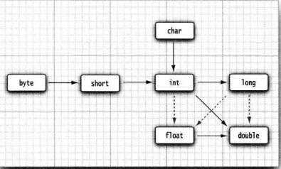
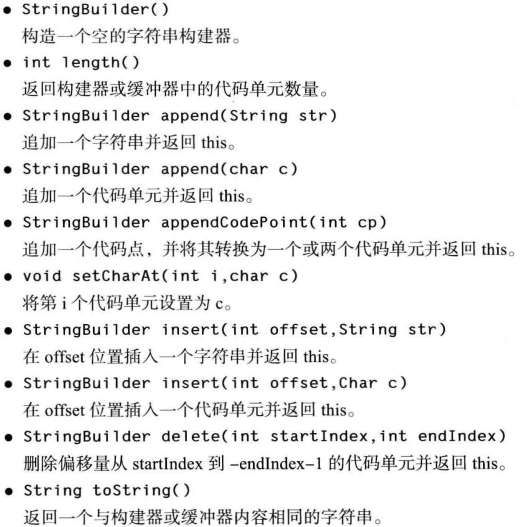
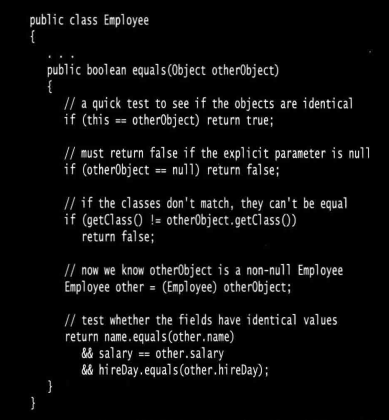
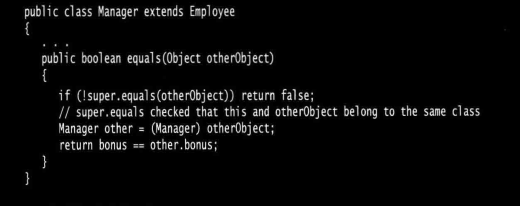
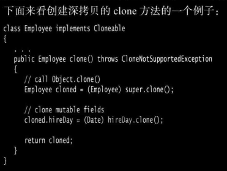
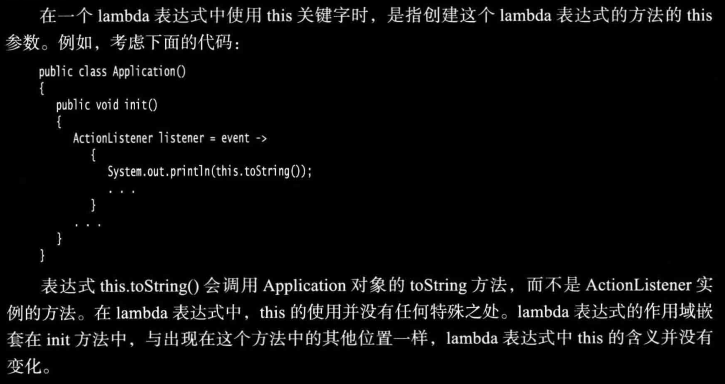

## 技术卷一：共14章730余页
计划第十、十一、十二、十三章有关图形界面、web应用部分不读（200余）

### 一二章：概述
- 简单性

没有头文件 、 指针运算 ( 甚至指针语法) 、结构 、 联合 、 操作符重载 、 虚基类
- 面向对象

面向对象方面，java和c++一样高效，但java和c++在多重继承上不同，java中使用接口代替
- 分布式
- 健壮性

早期问题检测、运行时动态检测；java采用的指针模型可以消除重写内存和损坏数据的可能性（和c++最大的不同点）
- 安全性
- 体系结构中立

java虚拟机。java编译器生成与特定的计算机体系结构无关的字节码指令文件，这种字节码容易在任何机器上运行（因为java虚拟机），且可动态翻译成本地机器码（即时翻译）
- 可移植性

这里提到一点，字符串用标准的Unicode格式存储
- 解释性

Java 解释器可以在任何移植了解释器的机器上执行 Java 字节码 
- 高性能

字节码可以 (在运行时刻 ) 动态地翻译成对应运行这个应用的特定 CPU 的机
器码

- 多线程
- 动态性

适应不断发展的环境库中可以自由地添加新方法和实例变量 , 而对客户端却没有任何影响

#### java 开发环境搭建及术语
- [安装java环境](https://github.com/josonle/Coding-Now/blob/master/Linux%E7%B3%BB%E7%BB%9F%E4%B8%8B%E5%BC%80%E5%8F%91%E7%8E%AF%E5%A2%83%E6%90%AD%E5%BB%BA/Deepin%E4%B8%8B%E6%90%AD%E5%BB%BAHadoop%E3%80%81Spark%E7%AD%89%E5%A4%A7%E6%95%B0%E6%8D%AE%E5%BC%80%E5%8F%91%E7%8E%AF%E5%A2%83.md#%E5%AE%89%E8%A3%85java%E7%8E%AF%E5%A2%83)
> src.zip是包含所有公共类库的源代码，eclipse中会自动解析的
```
# 命令行下编译运行java程序
javac Hello.java        //javac是java编译器程序，将Hello.java编译成Hello.class
java Hello      //java是java虚拟机程序，执行.class文件中的字节码
# 如果有参数，则类似java Hello a b c，用空格隔开，会传给args
```
- 术语
    - JDK：Java Development Kit，java开发工具（开发者使用）
    - JRE：Java Runtime Environment，java程序运行环境（用户使用），包含虚拟机但不含编译器


### 三四五六七八：java基础语法

- 大小写敏感

- 类名：字母开头，不允许使用java保留字 【建议参考驼峰命名法】；和源码文件(xxx.java)同名
- main方法：java虚拟机入口执行点，必须声明为public的静态的  【在 Java SE 1.4 及以后的版本中强制 main方法是 public 的 。】
- 注释
  - 单行注释（//xxxx）、多行注释（/\*xxxx\*/）【eclipse快捷键：前者Ctrl+/，后者Ctrl+Shift+/（取消是Ctrl+Shift+\）】
  - 文档注释（/\*\*xxxx\*/） 【eclipse快捷键：Shift+Alt+J】
- 八种数据类型（4整形，2浮点，char（Unicode编码），Boolean）
  - long类型有一个后缀 L 或 1 ( 如 4000000000L
  - 十六进制0x/0X开头，(java 7始)二进制0b/0B开头
  - float 类型的数值有一个后缀 F 或 f ( 例如 , 3.14 F) 。没有后缀 F 的浮点数值 ( 如 3.14 ) 默认为 double 类型，常用的就是double
  - 不建议使用char类型
  - 布尔型和整形不可相互转换

> 不同于C++之处：
>
> - C++中int 和 long 等类型的大小与目标平台相关，java无关，java中也没有什么无符号int、long什么的
> - C++中可以用0代替false，非0代替true，java不可以

- 变量与常量

  - 不可使用java保留字作为变量（常量）名

  - 变量必须显示初始化后才可以调用

  - **常量用 final 关键字**： final 表示这个变量只能被赋值一次 。 一旦被赋值之后, 就不能够再更改了。建议常量名大写

    ```java
    final Int BOY_NUMS = 100;
    ```

  - **类常量用 static final 关键字**：类常量的定义位于 main方法外，类中方法都可使用该常量。**如果再申明为 public 的**，则其他类的方法也可调用该常量

- 枚举类型 enum  【第五章】

- 运算符注意

  - `/`：除法，整数相除是整数除法（7/2=3），否则是浮点除法（7/2.0=3.5），被除数不可为0

  - `%`：求余

  - `++/--`：自增(减)，注意n++是先用后加，++n是先加后用

  - `&&/||`：短路与/或，第一个判断成立的话不会判断下一个表达式，**与比或优先级高**

  - `&/|`：逻辑与/或，表达式都有判断；或者位运算，位与/或

  - 运算符优先级

    

- 数值类型间的转换

  - 合法转换（不失精度，自动转），比如float+int，int型自动转为float型
       
  > 值得注意：数值型都可转换为String，当将一个字符串与一个非字符串的值进行拼接时 , 后者被转换成字符串
  - 强制类型转换（可能会丢失精度）

       ```java
       double num = 1.23;
       # 精度丢失只是截取，没有什么四舍五入之说
       System.out.println((int)num);//输出1
       
       # 如果运算符得到一个值, 其类型与左侧操作数的类型不同, 就会发生强制类型转换
       
       int x = 1;
       x+= 0.5;//(int)(x+0.5)
       System.out.println(x);//输出1
       ```

       > 像上面说过不能让布尔型和其他数值型间转换，核心卷中提到了三元运算符 b? 1:0 来转换

### 数组

- 创建数组但未赋值时，会默认初始化为默认值，如创建一个数字数组时, 所有元素都初始化为 0 ， boolean 数组的元素会初始化为 false ，对象数组的元素则初始化为一个特殊值 null
- 数组长度不许改变，需要扩展数组大小需使用ArrayList
- **数组长度可以为0，但不表示是null**，仅仅是空数组
- 数组复制问题（深(copyOf)、浅复制）
  - copyOf(arr ,length)：常也用来通过length参数改变数组长度

`import java.util.Arrays`数组Arrays类中提供的几个方法，sort（优化的快速排序）、binarySearch（二分查找）、equals（比较）


快速打印数组，`Arrays.toString(arr)`，`Arrays.deepToString(arr[ ] [ ])`(打印二维数组)

java中不提多维数组，只能说是**数组的数组**，实质就是一维数组。当需要不规则的数组时 , 只能单独地创建行数组，比如

```java
int[][] arr = new int[2][];
arr[1] = new int[2];
arr[2] = new int[3];
```


### 字符串方法

- 字符串不可变的好处：利于字符串的共享，像**字符串常量是共享的**

- 方法

  - sbstring：取子串

  - **equals和==**：前者判断内容相等，后者判断地址相等(同一对象，像字符串常量可以用这个)       [java中equals和compareTo的区别](https://www.cnblogs.com/ycpanda/p/3637153.html)

      - equalsIgnoreCase：不区分大小写
      - str1.**compareTo**(str2)==0：这个也是比较（字符串方法），equals是Object方法，不过被String重写了，equals效率更高
      - ==：用于8个基本数据类型的比较，**String是类是类**

  - +和String.join

      ```java
      System.out.println(String.join(",", "def","abc","ghi"));//用分隔符连接后面的str，def,abc,ghi
      ```

  - 空串（""）和Null串：`str.equals("")/str.length==0`,`str==null`

  - charAt(int index)：返回index处的代码单元（char），index是0到length-1，否则抛出 StringIndexOutOfBoundsException

  - startsWith和endsWith

  - indexOf(str,[fromIndex])：返回匹配str的第一个index位置，没匹配到返回-1

  - replace

  - trim：删除前后空格

- StringBuffer和StringBuilder类

  > StringBuffer 对方法加了同步锁或者对调用的方法加了同步锁，所以是线程安全的。StringBuilder 并没有对方法进行加同步锁，所以是非线程安全的。String是线程安全的
  >
  > StringBuffer效率略低于StringBuilder，但不用冒多线程不安全风险
  >
  > 1. 操作少量的数据 = String
  > 2. 单线程操作字符串缓冲区下操作大量数据 = StringBuilder
  > 3. 多线程操作字符串缓冲区下操作大量数据 = StringBuffer

  - 方法

### 条件、循环、switch case等流程控制语句

- **java中有goto保留字，但不允许使用**，但java中有一种带标签的break语句隐含包括了goto的作用

- **块作用域问题**

  ```java
  public static void main( String 口 args ){
  	int n;
  	...
      {
      int k ;
      int n; // Error can ' t redefine n in inner block
      }
  }
  # 不能在嵌套的两个块中声明同名的变量
  # C++中内层定义的变量如果和外层同名，会覆盖
  ```

- do ... while末尾别忘记分号

- foreach循环

- switch case：case 分支语句的末尾没有 break 语句, 那么就会接着执行下一个 case 分支语句，没匹配到则执行default分支

  - case 标签可以是 :
    - 类型为 char 、 byte 、 short 或 int 的常量表达式 。
    - 枚举常量 
    - java SE 7 开始可以是字符串

- 带标签的break语句：用来跳出多重嵌套循环

  - **标签必须放在希望跳出的最外层循环之前 , 并且必须紧跟一个冒号**
  - 跳出不是跳到标签位置处

  ```java
  int flag = 0;
  break_point: while (x < 10) {
  	flag++;
  	for (int i = 0; i < 5; i++) {
  		if (x > 2) {
  			x = 0;
  			break break_point;
  		}
  		x++;
  	}
  }//跳到这，不是又回到break_point处
  System.out.println("Flag is: "+flag);
  ```

  > 对于任何使用break 语句的代码都**需要检测循环是正常结束, 还是由 break 跳出**  
  >
  > - 不仅仅适用于循环，像if、块语句都可以用
  > - 只能是跳出块，不能跳到其他语句块内
  > - 不建议使用

-  也有带标签的continue语句

  

### 大数运算

基本数值精度无法满足需要时，Math类中提供BigInteger和BigDecimal两个类来处理包含任意长度数字序列的数值，前者是任意精度整数，后者任意精度浮点数

```java
import java.math.BigDecimal;
import java.math.BigInteger;

BigInteger a = BigInteger.valueOf(100000000000000000l);
BigInteger b = BigInteger.TEN;
a.add(b);
```

但不提供`+`、`-`、`*`、`/`这些运算符来操作，取而代之是add、subtract、multiply、divide等方法，其次只支持同类型相互运算，不能BigInteger和BigDecimal间操作

> 别想着重载运算符什么的，java中不支持重载运算符

### 面向对象

OOP：面向对象程序设计，数据第一，算法（如何操控这些数据）放在第二位


对象中的数据称为 **实例域**，对象是类实例化所产生的（也叫类构造对象）

> 所有的方法中不要命名与实例域同名的变量，因为会屏蔽实例域

谈到构造就要知道构造器（构造方法），**构造器和类同名**，构造器总是伴随着 new 操作符的执行被调用,只能被调用一次（而不能对一个已经存在的对象调用构造器来达到重新设置实例域的目的）。无返回值，可有0或多个参数，类中构造器至少得有一个（无构造器，系统也会默认给一个无参构造器）

> 类没有提供任何构造器的时候, 系统会提供一个默认的构造器
>
> 
>
> - 构造器可相互调用，但必须在第一句通过this(xxx)（xxx是要调用的构造器所需的参数）来调用，不要搞成死循环
>
>   - 有一个好处是有些实例域数据初始化必需的，省的每个构造器中都写一遍
>
> - 构造器还可以用super关键字调用（调用父类构造器，涉及继承）
>
>   - 当父类的构造器是无参构造函数时，在子类的构造器中可以不写super(xxx)，编译器会默认去调用父类构造器
>   - 当父类的构造函数是有参构造器时，在子类的构造器中必须写super(xxx)（xxx是父类构造器所需的参数）
>   - 因为继承的缘故，子类是要先实例化从父类中继承的方法和数据。**但是只是创建了一个子类对象**。其次，我看到有个解释是子类对象是隐式内置了一个父类对象的
>
> - 无论是this、super调用构造器，**只能出现其中一个，且写在构造器第一行**
>
>   > [为什么super(...)和this(...)只能在构造函数中的第一句出现？](https://blog.csdn.net/u012062841/article/details/11860187)
>   >
>   > 为啥this和super只能出现一个？this会调用其他构造器的，要是该构造器中也有super，就会再次super再次构造了一个隐含的父类对象，编译会报错
>
> 构造器初始化数据过程：
>
> - 所有数据域被初始化为默认值( 0 、 false 或 null )
> - **按照在类声明中出现的次序,** 依次执行所有域初始化语句和初始化块 
>   - 都比构造器先执行
> - 如果构造器第一行调用了第二个构造器, 则执行第二个构造器主体
> - 执行这个构造器的主体

类中其他定义的就是方法，常见的是main方法（自定义类中无）

> 像类调用方法，其实是有两类参数：隐式参数（调用该方法的对象本身，this），显式参数（方法定义的参数）
>
> 
>
> java中**方法中参数是传值调用**（方法得到的仅仅是参数值的一个拷贝），不像Python会有引用调用。**但还要注意一点是传入对象时是可以修改对象内部数据的**，和前面不冲突，同样是拷贝一份对象的引用，但该引用还是指向该对象，实际修改会造成对象内数据改动（**所以这还是值调用**）
>
> 
>
> 像C++中方法通常定义在类外，类内是内联方法，Java 中所有的方法都必须在类的内部定义

类中还有一种叫 **初始化块**的代码块，在类初始化时会先运行初始化块, 然后才运行构造器的主体部分

```java
# 书上例子
class Employee
{
    // instance fields
    private String name ;
    private double salary;
    private Local Date hireDay ;
    //object initialization block
    {
        name = xxx;
        ...
    }
    // constructor
    public Employee (St ring n , double s , int year , int month , int day )
    {
        name = n;
        salary = s ;
        hireDay = Local Date . of ( year , month , day ) ;
    }
    // a method
    public String getNameO
    {
    return name ;
    }
    // more methods
    ...
}
```

一个java源文件中只能有一个Public类（含main方法），非公有类可有多个。编译器会生成对应每个类的class字节码文件。也可以每个类单独一个java源文件，编译时自己会找到的

- 4种访问级别

  - public

  - private，本类可见。类中实例域建议是private，因为封装性缘故

  - proteced，对本包和所有子类可见。用于信赖子类去访问超类的某些数据和方法

    > 事实上 , Java 中的proteced部分**对所有子类及同一个包中的所有其他类都可见** 。这与 c ++ 中的保护机制稍有不同 , Java 中的protected 概念要比 C ++ 中的安全性差 。

  - 不加修饰符（默认的），对本包可见

- final和static在类中用法

  - final 实例域：final修饰的表明不可改变，类在实例化时必须为该实例域赋初值

    - final变量定义的时候，可以先声明，而不给初值，这中变量也称为final空白，**必须实例化时赋初值**
    - final可以修饰方法中的参数（final参数），方法中无法改变该参数值

  - static 静态域：类的所有示例对象所共享，它属于类, 而不属于任何独立的对象

    > 可以重新赋值吗？每个类中只有一个这样的域？搞不懂这里
    >
    > - 可以重新赋值(类中类外都可以)，也可以有多个
    > - static只是表明不需要实例化就可使用
    > - **注意：**如果static有private修饰，则**类外不可**直接通过类名的方式直接调用了，类中随便用

  - static final 静态常量

  - 静态方法：static修饰的方法，由类名直接调用（也可以由对象调用），不对任何对象进行操作。main就是静态方法

    - 静态方法不需要访问对象状态 , 其所需参数都是通过显式参数提供

    - 也因为直接通过类名调用，所以static方法中不允许出现this、super关键字

    - 静态方法只能访问类的静态域、静态方法

    - **静态方法作为工厂方法**    ？？？**不清楚这个**

      > 静态工厂方法：不通过new，而是静态方法来对外提供一个类实例化对象的方法    参考:【[关于 Java 的静态工厂方法，看这一篇就够了](https://www.diycode.cc/topics/1027)】
      >
      > ```java
      > class A{
      >     ...
      >     public static A getInstance(...){
      >         A a = new A();
      >         ...
      >         return a;
      >     }
      > }
      > A a = A.getInstance();//getInstance就是
      > //或
      > Integer n = Integer.valueOf("3");
      > ```
      >
      > 《Effective Java》中建议用静态工厂方法代替构造器，并提出四点优势：
      >
      > - 方法有名字，不用像构造器一样和类同名
      > - 不用每次被调用时都创建新对象
      > - 可以返回原返回类型的子类，构造器只能返回类本身的实例对象，但这个可以返回任何其子类的实例
      > - 在创建带泛型的实例时，能使代码变得简洁

  - 静态代码块：**jvm在加载类时，如果有static代码块就会执行该代码块**

    - 类中独立于类成员的static代码块，可以有多个，位置可以随便放，它不在任何的方法体内
    - 多个static代码块在jvm加载类时，按序依次执行，**每个代码块只会执行一次**
    - **多用来初始化静态变量**

  - final修饰的方法可以在继承时拒绝子类对其覆盖，final修饰的类可以拒绝被其他类继承  【这个下面会提到】

  - final不可修饰构造器

了解封装、继承、多态

- 封装

  - 关键是对象中的实例域不可被其他类直接访问，只能通过所提供的方法，提高了重用性和可靠性

- 继承

  - java中的继承是公有继承，不像C++中有私有、保护继承

  - 看核心卷的意思似乎是会继承超类的私有数据域和方法，但**子类方法不能直接访问超类的私有域**，必须借助超类提供的公有接口(方法)，像`super.func(xxx)`，super表示超类调用，不写super会报错。也**不能访问超类的私有方法的**

    > super并非类似this是一个对象的引用（super 不是一个对象的引用），不能将 super 赋给另一个对象变量, 它只是一个指示编译器调用超类方法的特殊关键字
    >
    > C++中会通过`超类名::超类方法`来调用该方法

  - 子类可增加数据域、方法，覆盖(override)方法，但不能删除所继承的方法、域

  - java中不支持多重继承，但提供一种叫`接口（interface）`的实现该功能

  - **final修饰的方法可以在继承时拒绝子类对其覆盖，final修饰的类可以拒绝被其他类继承** 

    - final类的所有方法都自动final化的，但是数据域不是

- 多态：子类的每个对象也是超类的对象

  ```
  # A是B的超类
  A a = new B();//这就是多态
  A a = new A();
  ```

  - P154 还需要再看几遍

总结下super和this

- this：1、用来调用类中其他构造器，2、调用类中方法或数据域
- super：1、用来调用超类构造器，2、用来调用超类方法

理解重载和多态

- 重载 overlode

类中多个方法有相同的名字，不同的参数, 便产生了重载 。不能有两个名字相同、参数类型也相同却返回不同类型值的方法

> 重载解析：编译器根据参数选择匹配调用哪个方法的过程
>
> java中方法的描述是通过方法名和参数类型（这叫方法签名signature）
>
> ```java
> //两个构造器
> public Interview(String namestring) {
> 		nameString = namestring;
> 	}
> //下面这个错误的，因为只识别方法名和参数类型，不会根据参数名来判断是否重载
> public Interview(String nametest) {
> 		nametest = nametest;
> 	}
> ```
>
> 

- 覆盖 override

覆盖发生在继承上，子类覆盖掉超类的方法。**注意覆盖方法时，子类方法的访问权限不能低于超类该方法**（比如超类有个public的，子类就不能是private）


导包问题 `package xxx`

主要是如果导入的两个包有同名的类，在调用时必需通过`包名.类名`来，否则编译器无法定位是哪个包的类


包的作用域问题

标记为 public 的部分可以被任意的类使用 ; 标记为 private 的部分只能被定义它们的类使用 。**如果没有指定 public 或 private , 这个部分 ( 类 、 方法或变量 )可以被同一个包中的所有方法访问**


import还可以导入静态方法和静态域，像`import java.Math.*`,然后可以直接在类中使用像sqrt这样的静态方法（而不需要Math.sqrt）

> 从 1.2 版开始, JDK 的实现者修改了类加载器 , 明确地禁止加载用户自定义的 、 包名以 “ java . ” 开始的类! 当然, 用户自定义的类无法从这种保护中受益 。 然而 , 可以通过包密封 ( package sealing ) 机制来解决将各种包混杂在一起的问题 。 如果将一个包密封起来 , 就不能再向这个包添加类了

继承层次上的强制类型转换

首先，根据多态可知子类对象的引用是可以直接赋给超类变量的，编译无问题。但把超类对象赋给子类变量会有问题，要在转换前通过`A instanceof B`判断是否可以转换

```java
# 核心卷的例子
# 超类Employee，staff存储的就是
# 子类Manager，boss就是子类变量
if ( staff[1] instanceof Manager)//判断staff[1]能否引用Manager对象，前者为null也可以，不会报错只是返回false
{
	boss = ( Manager) staff[1]；
	...
}
```

#### 抽象类

- abstract关键字

  ```	java
  public abstract Persion{
  	...
      public abstract void print();
      void print_(){
          //实现
      }
      ...
  }
  
  public class Man extends Persion{
      ...
      public void print(){System.out.print(...);}
      ...
  }
  ```

- 包含一个或多个抽象方法的类本身必须被声明为抽象的，抽象方法只是起占位作用，具体实现在子类中。类即使不含抽象方法, 也可以将类声明为抽象类

  - abstract不能与private、static、final或native共同修饰同一个方法，**因为要被继承**

- 抽象类还可以包含具体数据和具体方法（不建议有）

- 申明为abstract**的抽象类不能被实例化**，但可以创建一个抽象类的对象变量, 用来引用非抽象子类的对象

  ```java
  Persion p = new Man(...);//这里p因为不能构造Person对象，最终还是指向Man对象，所以可以调用Man的方法 （动态绑定，多态的一种）
  ```

- 抽象类不一定有抽象方法，但抽象方法一定属于抽象类。抽象类中的非抽象方法一定要给出实现

### 所有类的超类 Object

Java 中, 只有基本类型 ( primitive types ) 不是对象 , 例如 , 数值、 字符和布尔类型的值都不是对象 。所有的数组类型 , 不管是对象数组还是基本类型的数组都扩展了 Object 类 

#### equals方法



因为超类变量可以指向子类对象的引用，即`Object obj = new Employee()`，所以此处参数传入Object是OK的

Object类中equals是判断两个对象是否具有相同的引用（即两对象相等），实际equals用法如上图所示

进一步是子类中如何覆盖父类的equals方法？如图，先调用超类的equals，如果相等，则进一步比较子类中新增的实例域



> 还没完全搞清楚这里比较两对象相等，看书上说可以通过==、getClass、instanceof   P169

#### hashCode方法

每个对象会对应一个hash code（散列值，整型值），即对象存储地址。所以只要对象不相等散列值就不等

如果重新定义 equals 方法 , 就必须重新定义 hashCode 方法, 以便用户可以将对插入到散列表中

> 见：[重写equals方法的时候为什么需要重写hashcode](https://www.jianshu.com/p/75d9c2c3d0c1)

简单的话，可以直接写作：
```java
public int hashCode(){
    return Objects.hash(name,salary...);//直接调用Objects的hash方法，会对各个参数调用 Objects.hashCode 
}
```

如果是数组类型的域，可以用Arrays.hashCode(...)计算数组的散列值（有数组元素的散列值组成）

> 重写hashCode方法时会看到很多地方会乘以一个数（31）
>
> [为什么 String hashCode 方法选择数字31作为乘子](https://segmentfault.com/a/1190000010799123) 

#### toString方法

作用就是打印一些信息（一些有关对象状态的必要信息，像类名、域值、散列值等）

> 像类名建议是通过this.getClass().getSimpleName()获取

当对象与一个字符串通过操作符 “ + ” 连接起来 , Java 编译就会自动地调用 toString 方法, 以便获得这个对象的字符串描述


### ArrayLIst 泛型数组列表类

这是一个泛型类，用于动态更改数组空间大小的。

`ArrayList<Type> a = new ArrayList<>();`，Type是类型参数，后面那个<>也可以加上该参数，但编译器会自动推断，所以不用写

- `boolean add（new Type()）`:添加新的类对象，返回true
- `void ensureCapacity( int length )`或 `new ArrayList<>(int length)`：在确保数组列表需要多少空间时可以指定其存储容量
  - 数组列表的容量与数组的大小有一个非常重要的区别。比如指定容量100，只是指最多保留100个对象，并非立刻开辟100个空间。完成初始化构造之后, 数组列表根本就不含有任何元素
- `int size()`：当前所含元素数量
- `void trimToSize()`：将数组列表的存储容量削减到当前尺寸
- set/get/remove：替换/获取/删除数组列表中的元素

### 对象包装器和自动装箱

Integer 、 Long 、 Float 、 Double 、 Short 、 Byte 、 Character 、 Void 和Boolean ( 前6 个类派生于公共的超类 Number ) 。**对象包装器类是不可变的**, 即一旦构造了包装器, 就不允许更改包装在其中的值 。同时, **对象包装器类还是 final** , 即不允许被继承

由于每个值分别包装在对象中, 所以 ArrayList < lnteger > 的效率远远低于 int [ ] 数
组。因此 , 应该用它构造小型集合 , 其原因是此时程序员操作的方便性要比执行效率更加重要 

对象包装器对象的比较不建议使用==，而使用equals

> 自动装箱规范要求 boolean 、 byte 、 char<=127 , 介于 - 128 ~ 127 之间的 short 和 int 被包装到固定的对象中 。 例如 , 如果在前面的例子中将 a 和 b 初始化为 100 , 对它们进行比较的结果一定成立

如果在一个条件表达式中混合使用 Integer 和 Double 类型, Integer 值就会拆箱,
提升为 double , 再装箱为 Double


包装器类引用可以为 nul


***

- 可变参数数量？？？（Int ... values）

不过是写在最后一个参数位置，允许将一个数组传递给可变参数方法的最后一个参数，编译器会将该参数绑定到数组上, 并在必要的时候进行自动装箱


### 接口

必须是public的，关键字interface。其中方法默认是public，所以可以不写public，实现该接口的类必须实现接口中**所有非default方法**）。可定义常量，但不能包含实例域或静态方法。

> 接口中方法自动public，数据自动public static final化
>
> java 8 后可以在接口中定义静态方法
>
> **类只能有一个超类，但可实现多个接口**
>
> 常用接口有Comparable（compareTo方法）、Comparator（compare方法）、Cloneable（clone方法）
>
> Cloneable 接口 它没有指定clone 方法, 这个方法是从 Object 类继承的。其实java提供的**标记接口**（标记接口不包含任何方法; 它唯一的作用就是允许在类型查询中使用 instanceof）
>
> Object也提供一个clone方法用以对象的拷贝，但是protected的，**提供对象的浅拷贝**。所有当类中含有其他类对象的引用时浅拷贝就不行了，此时要实现Cloneable接口重新定义一个public的clone方法（深拷贝）
>
> 
>
> 如果在一个对象上调用 clone , 但这个对象的类并没有实现 Cloneable 接口 , Object 类的 clone 方法就会拋出一个 CloneNotSupportedException

实现接口的类，必须实现接口中所有非default方法，且**必须是public的**

```java
public interface A<T>{//可以使用泛型类型，也可以不加。不加的话默认是Object，在方法是现实时要手动将Object类型转换成所需对象类型
    int AGE = 18;//static final int AGE
    ...
    void B(...);
    int C(T other);
    ...
}
//实现接口关键字implements
class aA implements A<aA>{
    ...
    public void B(...){...}
    public int C(aA other){...}
}
```


> 两个数值比较时
>
> 如果是整数可以直接相减，但要注意整数的范围不能过大 （比如都不是负整数，或绝对值不超过 (Integer.MAX_VALUE-1)/2 ）, 以避免造成减法运算的溢出；否则就要用Integer.compare方法。
>
> 
>
> 如果是浮点数比较，不能直接相减，相减接近零时会四舍五入为零，直接用Double.compare方法

- 接口不是类，所以不能new一个什么接口对象，但是可以创建一个接口变量引用实现该接口的类对象。

- 可通过instanceof判断对象是否实现了某接口

- 接口也可以被扩展(继承) `public interface B extends A{}`

- **可以为接口中方法提供默认实现，要用到default关键字**

  ```java
  public interface A{
  	...
      default void bFunc(){
          System.out.println("...");
      }
  }
  //实际编程时，最好把接口单一文件。public类是程序入口，所以不能再在该文件下写一个public的接口/类等
  ```

  感觉没啥用，实现类可以选择覆盖该方法

**接口和超类有同名、相同参数类型的方法，讲究类优先**

`class C extends A implements B`如果A、B中有上述方法，只考虑超类A的方法


### lambda表达式：用以java支持函数式编程

lambda表达式的形式：参数（小括号括起）、箭头（->）、表达式（可用{}括起）

- 无参数也要用空括号()
- 一个表达式写不下可以用{}括起，并包含显示的return语句
- 如果可以推导出一个 lambda 表达式的参数类型, 则可以忽略其类型
- 如果方法只有一 参数 , 而且这个参数的类型可以推导得出 , 那么甚至还可以省略小括号
- 无需指定 lambda 表达式的返回类型。lambda 表达式的返回类型总是会由上下文推导得出
- 如果一个 lambda 表达式只在某些分支返回一个值, 而在另外一些分支不返回值,这是不合法的 。 例如：`( int x ) -> { if (x >= 0 ) return 1 ; } `就不合法 
- 在 lambda 表达式中是可以用代码块外部的变量的, 但只能引用值不会改变的变量（避免并发时不安全问题）
- lambda表达式中this参数问题
   


### 内部类：类中类

优势：

- 内部类方法可以访问该类定义所在的作用域中的数据, 包括私有的数据
-  内部类可以对同一个包中的其他类隐藏起来 
- 当想要定义一个回调函数且不想编写大量代码时, 使用匿名 ( anonymous）内部类比较便捷


只有内部类可以是私有类, 而常规类只可以具有包可见性 , 或公有可见性


并非每个外部类对象都包含内部类的实例域，前提是要调用方法（外部类的方法）实例化内部类

- 局部内部类：定义在方法或作用域中的类，有点是完全隐藏，只有该方法可访问它  **局部类不能用 public 或 private 访问说明符进行声明，直接写class就好了**

  - 好有个优势是可以访问方法的局部变量，但必须是final的

- 匿名内部类：无访问修饰符、无类名

  - 无类名所以没有构造器
  - **当所在的方法的形参需要被内部类里面使用时，该形参必须为final**
  - 使用匿名内部类时，必须是继承一个类或者是实现一个接口

  > 参考：
  >
  > [java提高篇(八)----详解内部类](https://www.cnblogs.com/chenssy/p/3388487.html)
  >
  > [java提高篇(十)-----详解匿名内部类](https://www.cnblogs.com/chenssy/p/3390871.html)

- 静态内部类：static修饰的内部类，也叫嵌套内部类

  - 创建不依靠外围类
  - 只能访问外围类的静态数据、方法
  - **与常规内部类不同 , 静态内部类可以有静态域和方法**

  ```java
  public class OuterClass {
      private String sex;
      public static String name = "chenssy";
      
      /**
       *静态内部类
       */
      static class InnerClass1{
          /* 在静态内部类中可以存在静态成员 */
          public static String _name1 = "chenssy_static";
          
          public void display(){
              /* 
               * 静态内部类只能访问外围类的静态成员变量和方法
               * 不能访问外围类的非静态成员变量和方法
               */
              System.out.println("OutClass name :" + name);
          }
      }
      
      /**
       * 非静态内部类
       */
      class InnerClass2{
          /* 非静态内部类中不能存在静态成员 */
          public String _name2 = "chenssy_inner";
          /* 非静态内部类中可以调用外围类的任何成员,不管是静态的还是非静态的 */
          public void display(){
              System.out.println("OuterClass name：" + name);
          }
      }
      
      /**
       * @desc 外围类方法
       * @author chenssy
       * @data 2013-10-25
       * @return void
       */
      public void display(){
          /* 外围类访问静态内部类：内部类. */
          System.out.println(InnerClass1._name1);
          /* 静态内部类 可以直接创建实例不需要依赖于外围类 */
          new InnerClass1().display();
          
          /* 非静态内部的创建需要依赖于外围类 */
          OuterClass.InnerClass2 inner2 = new OuterClass().new InnerClass2();
          /* 方位非静态内部类的成员需要使用非静态内部类的实例 */
          System.out.println(inner2._name2);
          inner2.display();
      }
      
      public static void main(String[] args) {
          OuterClass outer = new OuterClass();
          outer.display();
      }
  }
  ----------------
  Output:
  chenssy_static
  OutClass name :chenssy
  chenssy_inner
  OuterClass name：chenssy
  ```

> 感觉核心卷这里讲的有点复杂，找到上面列出的博客，感觉还是不错的

《Think in Java》中由以下几点内部类优势：

​      **1、**内部类可以用多个实例，每个实例都有自己的状态信息，并且与其他外围对象的信息相互独立。

​      **2、**在单个外围类中，可以让多个内部类以不同的方式实现同一个接口，或者继承同一个类。

​      **3、**创建内部类对象的时刻并不依赖于外围类对象的创建。

​      **4、**内部类并没有令人迷惑的“is-a”关系，他就是一个独立的实体。

​      **5、**内部类提供了更好的封装，除了该外围类，其他类都不能访问。

最大优势是内部类使得多重继承的解决方案变得更加完整


- **如何实例化内部类**

```java
OuterClass.InnerClass inner = outer.new InnerClass();//outer是OuterClass实例对象
# 我看到如下，外部类中定义一个获取内部类的方法（建议）
 public InnerClass getInnerClass(){
        return new InnerClass();
 }
```

**外围类作用域外通过OuterClass.InnerClass来引用内部类，内部类中通过OuterClass.this来定义外围类的引用**

- **内部类中声明的所有静态域都必须是 final，不能有static方法**（Java 语言规范对这个限制没有做任何解释。也可以允许有静态方法 , 但只能访问外围类的静态域、方法）


内部类是个编译时的概念，一旦编译成功后，它就与外围类属于两个完全不同的类（当然他们之间还是有联系的）。对于一个名为OuterClass的外围类和一个名为InnerClass的内部类，在编译成功后，会出现这样两个class文件：OuterClass.class和OuterClass$InnerClass.class

