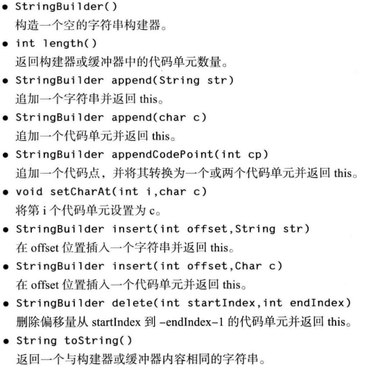

## 技术卷一：共14章730余页
计划第十、十一、十二、十三章有关图形界面、web应用部分不读（200余）

### 一二章：概述
- 简单性

没有头文件 、 指针运算 ( 甚至指针语法) 、结构 、 联合 、 操作符重载 、 虚基类
- 面向对象

面向对象方面，java和c++一样高效，但java和c++在多重继承上不同，java中使用接口代替
- 分布式
- 健壮性

早期问题检测、运行时动态检测；java采用的指针模型可以消除重写内存和损坏数据的可能性（和c++最大的不同点）
- 安全性
- 体系结构中立

java虚拟机。java编译器生成与特定的计算机体系结构无关的字节码指令文件，这种字节码容易在任何机器上运行（因为java虚拟机），且可动态翻译成本地机器码（即时翻译）
- 可移植性

这里提到一点，字符串用标准的Unicode格式存储
- 解释性

Java 解释器可以在任何移植了解释器的机器上执行 Java 字节码 
- 高性能

字节码可以 (在运行时刻 ) 动态地翻译成对应运行这个应用的特定 CPU 的机
器码

- 多线程
- 动态性

适应不断发展的环境库中可以自由地添加新方法和实例变量 , 而对客户端却没有任何影响

#### java 开发环境搭建及术语
- [安装java环境](https://github.com/josonle/Coding-Now/blob/master/Linux%E7%B3%BB%E7%BB%9F%E4%B8%8B%E5%BC%80%E5%8F%91%E7%8E%AF%E5%A2%83%E6%90%AD%E5%BB%BA/Deepin%E4%B8%8B%E6%90%AD%E5%BB%BAHadoop%E3%80%81Spark%E7%AD%89%E5%A4%A7%E6%95%B0%E6%8D%AE%E5%BC%80%E5%8F%91%E7%8E%AF%E5%A2%83.md#%E5%AE%89%E8%A3%85java%E7%8E%AF%E5%A2%83)
> src.zip是包含所有公共类库的源代码，eclipse中会自动解析的
```
# 命令行下编译运行java程序
javac Hello.java        //javac是java编译器程序，将Hello.java编译成Hello.class
java Hello      //java是java虚拟机程序，执行.class文件中的字节码
# 如果有参数，则类似java Hello a b c，用空格隔开，会传给args
```
- 术语
    - JDK：Java Development Kit，java开发工具（开发者使用）
    - JRE：Java Runtime Environment，java程序运行环境（用户使用），包含虚拟机但不含编译器


### 三四五六七八：java基础语法

- 大小写敏感

- 类名：字母开头，不允许使用java保留字 【建议参考驼峰命名法】；和源码文件(xxx.java)同名
- main方法：java虚拟机入口执行点，必须声明为public的静态的  【在 Java SE 1.4 及以后的版本中强制 main方法是 public 的 。】
- 注释
  - 单行注释（//xxxx）、多行注释（/\*xxxx\*/）【eclipse快捷键：前者Ctrl+/，后者Ctrl+Shift+/（取消是Ctrl+Shift+\）】
  - 文档注释（/\*\*xxxx\*/） 【eclipse快捷键：Shift+Alt+J】
- 八种数据类型（4整形，2浮点，char（Unicode编码），Boolean）
  - long类型有一个后缀 L 或 1 ( 如 4000000000L
  - 十六进制0x/0X开头，(java 7始)二进制0b/0B开头
  - float 类型的数值有一个后缀 F 或 f ( 例如 , 3.14 F) 。没有后缀 F 的浮点数值 ( 如 3.14 ) 默认为 double 类型，常用的就是double
  - 不建议使用char类型
  - 布尔型和整形不可相互转换

> 不同于C++之处：
>
> - C++中int 和 long 等类型的大小与目标平台相关，java无关，java中也没有什么无符号int、long什么的
> - C++中可以用0代替false，非0代替true，java不可以

- 变量与常量

  - 不可使用java保留字作为变量（常量）名

  - 变量必须显示初始化后才可以调用

  - **常量用 final 关键字**： final 表示这个变量只能被赋值一次 。 一旦被赋值之后, 就不能够再更改了。建议常量名大写

    ```java
    final Int BOY_NUMS = 100;
    ```

  - **类常量用 static final 关键字**：类常量的定义位于 main方法外，类中方法都可使用该常量。**如果再申明为 public 的**，则其他类的方法也可调用该常量

- 枚举类型 enum  【第五章】

- 运算符注意

  - `/`：除法，整数相除是整数除法（7/2=3），否则是浮点除法（7/2.0=3.5），被除数不可为0

  - `%`：求余

  - `++/--`：自增(减)，注意n++是先用后加，++n是先加后用

  - `&&/||`：短路与/或，第一个判断成立的话不会判断下一个表达式，**与比或优先级高**

  - `&/|`：逻辑与/或，表达式都有判断；或者位运算，位与/或

  - 运算符优先级

    

- 数值类型间的转换

  - 合法转换（不失精度，自动转），比如float+int，int型自动转为float型
       
  > 值得注意：数值型都可转换为String，当将一个字符串与一个非字符串的值进行拼接时 , 后者被转换成字符串
  - 强制类型转换（可能会丢失精度）

       ```java
       double num = 1.23;
       # 精度丢失只是截取，没有什么四舍五入之说
       System.out.println((int)num);//输出1
       
       # 如果运算符得到一个值, 其类型与左侧操作数的类型不同, 就会发生强制类型转换
       
       int x = 1;
       x+= 0.5;//(int)(x+0.5)
       System.out.println(x);//输出1
       ```

       > 像上面说过不能让布尔型和其他数值型间转换，核心卷中提到了三元运算符 b? 1:0 来转换

### 数组

- 创建数组但未赋值时，会默认初始化为默认值，如创建一个数字数组时, 所有元素都初始化为 0 ， boolean 数组的元素会初始化为 false ，对象数组的元素则初始化为一个特殊值 null
- 数组长度不许改变，需要扩展数组大小需使用ArrayList
- **数组长度可以为0，但不表示是null**，仅仅是空数组
- 数组复制问题（深(copyOf)、浅复制）
  - copyOf(arr ,length)：常也用来通过length参数改变数组长度

`import java.util.Arrays`数组Arrays类中提供的几个方法，sort（优化的快速排序）、binarySearch（二分查找）、equals（比较）


快速打印数组，`Arrays.toString(arr)`，`Arrays.deepToString(arr[ ] [ ])`(打印二维数组)

java中不提多维数组，只能说是**数组的数组**，实质就是一维数组。当需要不规则的数组时 , 只能单独地创建行数组，比如

```java
int[][] arr = new int[2][];
arr[1] = new int[2];
arr[2] = new int[3];
```


### 字符串方法

- 字符串不可变的好处：利于字符串的共享，像**字符串常量是共享的**

- 方法

  - sbstring：取子串

  - **equals和==**：前者判断内容相等，后者判断地址相等(同一对象，像字符串常量可以用这个)       [java中equals和compareTo的区别](https://www.cnblogs.com/ycpanda/p/3637153.html)

      - equalsIgnoreCase：不区分大小写
      - str1.**compareTo**(str2)==0：这个也是比较（字符串方法），equals是Object方法，不过被String重写了，equals效率更高
      - ==：用于8个基本数据类型的比较，**String是类是类**

  - +和String.join

      ```java
      System.out.println(String.join(",", "def","abc","ghi"));//用分隔符连接后面的str，def,abc,ghi
      ```

  - 空串（""）和Null串：`str.equals("")/str.length==0`,`str==null`

  - charAt(int index)：返回index处的代码单元（char），index是0到length-1，否则抛出 StringIndexOutOfBoundsException

  - startsWith和endsWith

  - indexOf(str,[fromIndex])：返回匹配str的第一个index位置，没匹配到返回-1

  - replace

  - trim：删除前后空格

- StringBuffer和StringBuilder类

  > StringBuffer 对方法加了同步锁或者对调用的方法加了同步锁，所以是线程安全的。StringBuilder 并没有对方法进行加同步锁，所以是非线程安全的。String是线程安全的
  >
  > StringBuffer效率略低于StringBuilder，但不用冒多线程不安全风险
  >
  > 1. 操作少量的数据 = String
  > 2. 单线程操作字符串缓冲区下操作大量数据 = StringBuilder
  > 3. 多线程操作字符串缓冲区下操作大量数据 = StringBuffer

  - 方法

### 条件、循环、switch case等流程控制语句

- **java中有goto保留字，但不允许使用**，但java中有一种带标签的break语句隐含包括了goto的作用

- **块作用域问题**

  ```java
  public static void main( String 口 args ){
  	int n;
  	...
      {
      int k ;
      int n; // Error can ' t redefine n in inner block
      }
  }
  # 不能在嵌套的两个块中声明同名的变量
  # C++中内层定义的变量如果和外层同名，会覆盖
  ```

- do ... while末尾别忘记分号

- foreach循环

- switch case：case 分支语句的末尾没有 break 语句, 那么就会接着执行下一个 case 分支语句，没匹配到则执行default分支

  - case 标签可以是 :
    - 类型为 char 、 byte 、 short 或 int 的常量表达式 。
    - 枚举常量 
    - java SE 7 开始可以是字符串

- 带标签的break语句：用来跳出多重嵌套循环

  - **标签必须放在希望跳出的最外层循环之前 , 并且必须紧跟一个冒号**
  - 跳出不是跳到标签位置处

  ```java
  int flag = 0;
  break_point: while (x < 10) {
  	flag++;
  	for (int i = 0; i < 5; i++) {
  		if (x > 2) {
  			x = 0;
  			break break_point;
  		}
  		x++;
  	}
  }//跳到这，不是又回到break_point处
  System.out.println("Flag is: "+flag);
  ```

  > 对于任何使用break 语句的代码都**需要检测循环是正常结束, 还是由 break 跳出**  
  >
  > - 不仅仅适用于循环，像if、块语句都可以用
  > - 只能是跳出块，不能跳到其他语句块内
  > - 不建议使用

-  也有带标签的continue语句

  

### 大数运算

基本数值精度无法满足需要时，Math类中提供BigInteger和BigDecimal两个类来处理包含任意长度数字序列的数值，前者是任意精度整数，后者任意精度浮点数

```java
import java.math.BigDecimal;
import java.math.BigInteger;

BigInteger a = BigInteger.valueOf(100000000000000000l);
BigInteger b = BigInteger.TEN;
a.add(b);
```

但不提供`+`、`-`、`*`、`/`这些运算符来操作，取而代之是add、subtract、multiply、divide等方法，其次只支持同类型相互运算，不能BigInteger和BigDecimal间操作

> 别想着重载运算符什么的，java中不支持重载运算符

### 面向对象

OOP：面向对象程序设计，数据第一，算法（如何操控这些数据）放在第二位


对象中的数据称为 **实例域**，对象是类实例化所产生的（也叫类构造对象）

> 所有的方法中不要命名与实例域同名的变量，因为会屏蔽实例域

谈到构造就要知道构造器（构造方法），**构造器和类同名**，构造器总是伴随着 new 操作符的执行被调用,只能被调用一次（而不能对一个已经存在的对象调用构造器来达到重新设置实例域的目的）。无返回值，可有0或多个参数，类中构造器至少得有一个

> 类没有提供任何构造器的时候, 系统会提供一个默认的构造器
>
> 
>
> 构造器可相互调用，但必须在第一句通过this(xxx)来调用，不要搞成死循环
>
> 构造器初始化数据过程：
>
> - 所有数据域被初始化为默认值( 0 、 false 或 null )
> - **按照在类声明中出现的次序,** 依次执行所有域初始化语句和初始化块 
>   - 都比构造器先执行
> - 如果构造器第一行调用了第二个构造器, 则执行第二个构造器主体
> - 执行这个构造器的主体

类中其他定义的就是方法，常见的是main方法（自定义类中无）

> 像类调用方法，其实是有两类参数：隐式参数（调用该方法的对象本身，this），显式参数（方法定义的参数）
>
> 
>
> java中**方法中参数是传值调用**（方法得到的仅仅是参数值的一个拷贝），不像Python会有引用调用。**但还要注意一点是传入对象时是可以修改对象内部数据的**，和前面不冲突，同样是拷贝一份对象的引用，但该引用还是指向该对象，实际修改会造成对象内数据改动（**所以这还是值调用**）
>
> 
>
> 像C++中方法通常定义在类外，类内是内联方法，Java 中所有的方法都必须在类的内部定义

类中还有一种叫 **初始化块**的代码块，在类初始化时会先运行初始化块, 然后才运行构造器的主体部分

```java
# 书上例子
class Employee
{
    // instance fields
    private String name ;
    private double salary;
    private Local Date hireDay ;
    //object initialization block
    {
        name = xxx;
        ...
    }
    // constructor
    public Employee (St ring n , double s , int year , int month , int day )
    {
        name = n;
        salary = s ;
        hireDay = Local Date . of ( year , month , day ) ;
    }
    // a method
    public String getNameO
    {
    return name ;
    }
    // more methods
    ...
}
```

一个java源文件中只能有一个Public类（含main方法），非公有类可有多个。编译器会生成对应每个类的class字节码文件。也可以每个类单独一个java源文件，编译时自己会找到的

- 4种访问级别

  - 类中实例域建议是private，因为封装性缘故

- final和static在类中用法

  - final 实例域：final修饰的表明不可改变，类在实例化时必须为该实例域赋初值

  - static 静态域：类的所有示例对象所共享，它属于类, 而不属于任何独立的对象

    > ???：可以重新赋值吗？每个类中只有一个这样的域？搞不懂这里

  - static final 静态常量

  - 静态方法：static修饰的方法，由类名直接调用（也可以由对象调用），不对任何对象进行操作。main就是静态方法

    - 一个方法不需要访问对象状态 , 其所需参数都是通过显式参数提供
    - 一个方法只需要访问类的静态域
    - **静态方法作为工厂方法**    ？？？**不清楚这个**

了解封装、继承、多态

- 封装
  - 关键是对象中的实例域不可被其他类直接访问，只能通过所提供的方法，提高了重用性和可靠性
  - 


理解重载和多态

- 重载

类中多个方法有相同的名字，不同的参数, 便产生了重载 。不能有两个名字相同、参数类型也相同却返回不同类型值的方法

> 重载解析：编译器根据参数选择匹配调用哪个方法的过程