# 词法分析
```
NFA、DFA构建
NFA到DFA的转换
DFA的化简
```
> NFA和DFA区别：
> DFA与NFA的区别表现为两个方面:一是NFA可以若干个开始状态，而DFA仅只一个开始状态。 另一方面，DFA的映象M是从K×∑到K，而NFA的映象M是从K×∑到K的子集， 即映象M将产生一个状态集合（可能为空集），而不是单个状态。

# 语法分析
```
上下文无关文法  【OK】
最左推导、最右推导  【OK】
分析树  【OK】
二义性  【OK】
消除左递归  【OK】
提取左因子  【OK】
形式语言鸟瞰  【OK】
LL（1）文法  【OK】
FIRST、FOLLOW集  【OK】
构造预测分析表  【OK】
用预测分析表对输入串进行分析的过程(59页)  【OK】
归约  【OK】
句柄  【OK】
活前缀
构造SLR、LR分析表  【OK】
SLR分析器对输入串进行分析的格局变化和相应动作（70页）
LR分析器对输入串进行分析的格局变化和相应动作（70页）
```

四种类型文法，0、1、2、3型文法，描述能力依次减弱。
- 0型文法，也叫短语文法，产生式左右部都是非终结符和终结符的并集，且左部至少含一个非终结符
- 1型文法（上下文有关文法），在0型基础上限制产生式左部的符号个数小于等于右部符号个数
- 2型文法（上下文无关文法），在0型基础上限制产生式左部只能是非终结符
- 3型文法（正规文法），等价于正规式，产生式为A->a或A->aB，A、B是非终结符，a是终结符（即右部以终结符始）

自上而下分析：LL(1)文法，最左推导
自下而上分析：LR(0)/LR(1)分析、SLR分析，最右推导，规约（这里不讨论LALR分析）

LL（1）：最左推导
LR（0）：最右推导
SLR(1):：不存在规约、移进冲突
LR(1)：不存在规约、规约冲突
LALR(1)：能合并，不冲突
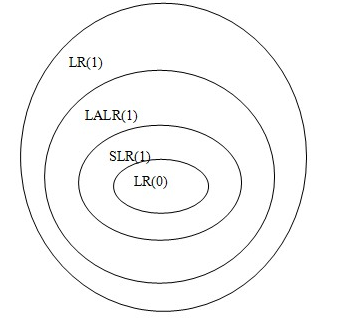
> LL(1)文法判断：两条准则，见下文
> SLR(1)文法判断：画出LR(0)自动机，判断无移进-规约冲突
> LR(1)和LALR(1)文法判断：画出文法的LR(1)自动机，如果没有同心项且没有状态冲突，则该文法是LALR(1)文法；如果有同心项且合并同心项有状态冲突，则是LR（1）文法

## 最左／右推导
lm、rm
***

在判断LL(1)文法时，需要查看是否存在左递归、左因子，存在的话就不是LL(1)文法，所以要消除左递归，提取左因子
> 上下文无关文法消除左递归，提取左因子是LL(1)文法的必要条件

## 消除左递归
自上而下的分析方法不能用于左递归文法，所以要消除左递归。递归又分为直接左递归（类似Ａ->Aa）和非直接左递归（经过两步或多步推导形成的左递归）

- 消除直接左递归

设有文法产生式：`A→Aβ|γ`。其中β非空，γ不以A打头。
可写为：`A→γA'，A'→βA'|ε` （别遗忘了ε）
> γ是ε时，也写成Ａ→A'

```
E→E+T |T
T→T*F | F
F→ (E)|i
```
如上存在前两句都有直接左递归
```
Ｅ→TE'
E'→+TE'|ε
T→FT'
T'→*FT'|ε
F→ (E)|i
```
- 消除非直接左递归

```
A→aB
A→Bb
B→Ac
B→d
```
先替换，将非直接变为直接左递归，再按照消除直接左递归方法消除
```
＃　替换
Ａ→Ａcb|aB
B→Ac|d
#  消除
A→aBA'
A'→cbA'|ε
B→Ac|d
```
## 提取左因子
提取左因子也是为了产生适合自上而下分析的文法
形如A→αβ1|αβ2，输入串前缀是α时，无法确定该用αβ1还是αβ2来扩展A，所以可以提取左因子α，扩展到A→αA'，再A'→β1|β2
```
A→αβ1|αβ2
# 提取左因子
A→αA'
A'→β1|β2
```
## First和Follow集求解
Vt是终结符，Vn是非终结符
### First集求法
- 终结符的first集是它本身，即x∈Vt，first(x)={x}
- x∈Vn，x->a...（或者x->ε），a∈Vt，则把a（或ε）加入first(x)
- x∈Vn，x->Y...，Y∈Vn，则把first(Y)-ε加入first(x)，即Y的first集去掉ε加入first(x)
- x∈Vn，x->Y1Y2...Yn...，Yi∈Vn，且Y1、Y2...Yi都能推导出ε，则把Y1、Y2...Yi的first集去掉ε和Yi后面的串的first集加入first(x)
- x∈Vn，x->Y1Y2...Yn...，所有Yi∈Vn，且Yi都能推导出ε，则把Yi的first集都加入first(x)，包含ε
> 后两条细谈一下：
> 像 S->ABCd
> 如果ABC都能多步推导出ε，则first(S)=（first(A)-ε）+（first(B)-ε）+（first(C)-ε）+first(d)
> 如果像C不能推出ε，则first(S)=（first(A)-ε）+（first(B)-ε）+first(C)
> 要是像S->ABC，ABC都能多步推导出ε，则first(S)=first(A)+first(B)+first(C)

其实求解串A的first集，就是求解A的所有可能的开始符号集，我感觉。同理follow就是所有可能的A后面跟的符号集

### Follow集求法
针对非终结符求Follow集，求解时关注的是产生式右部，具体是紧跟该非终结符右边的

- 如果X是文法开始符号（文法第一句的左部），则要把$加入Follow(X)
- 像产生式A→αBβ，要把first(β)-ε加入Follow(B)，如果β能推导出ε，则还要把Follow(A)加入Follow(B)
- 还有一点是如果所有产生式右部都不存在x后紧跟符号，则Follow(x)就等于该条产生式左部符号的Follow集。即A->BC满足上述时，Follow(C)=Follow(A)


## LL(1)文法判断
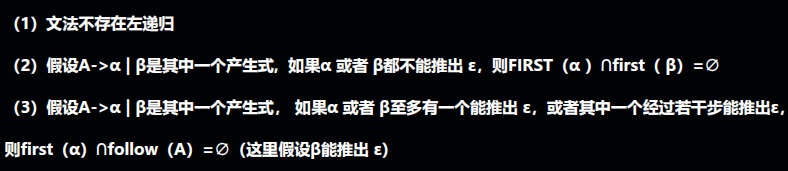

最简单的一些特征是无左因子，无左递归，无二义性。还看不出来，只能走定义，看哪条生成式可以推出两种条件，然后就是判断了

问题是当求first(α)时，怎么求？
举个例子A->aBc和A->BCd
first(aBC)=a
first(BCd)，如果B能推出ε，就等于first(B)-ε+first(Cd)，不能的话就是first(B)；（B能推出ε）然后继续判断C是否能退出ε，不能的话最后答案就是first(B)-ε+first(C)，能的话就是first(B)-ε+first(C)-ε+first(d)

***
## 构造LL(1)预测分析表
主要还是求first、follow集，然后按照算法：
对于G中的每一个产生式， A -> α ,执行以下2步：

1. for  ∀ a ∈ FIRST(α)， 将 A -> α 填入 M [A, a ];
2. if（ε ∈ FIRST(α)）
         ∀ a ∈ FOLLOW (A) （包含$）， 将 A -> ε 填入 M [A, a ];

（P58）书上举的例子，如图
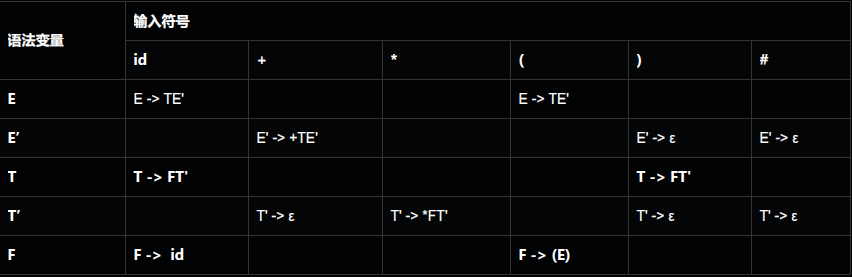
可参考这篇文章：<https://blog.csdn.net/hit_rxz/article/details/41652171>

## 规约、句柄、活前缀
规约是最右推导的逆过程，是为了得到产生式的左部

句柄定义见P65，性质有句柄右侧都是终结符，如果文法二义性则句柄可能不唯一

活前缀见P70，我的理解是由一个产生式规约成另一个（比如αβω到αAω），β是句柄，而活前缀不超过该句柄最右端的前缀字符串
> S→AdB →AdBdb  （使用 B→Bdb 规约 ），句柄是Bdb，活前缀有A，Ad，AdB，AdBd，AdBdb

移进规约

- 所有SLR(1) 文法都是 LALR(1) 文法
- 所有LL(1) 文法都是LR(1) 文法

## SLR(1)、LR(1)、LALR分析表构建
### 构造SLR(1)分析表
> 见P105习题3.19

1. 先分析扩广文法
2. 根据扩广文法得出LR(0)项目集规范簇 C ={I1，I2，...，In}，就是分析出In来
3. 根据In提取出action和goto
  1. 像goto(I0，E) = I1，就对应goto表中第0行第E列，值为1
  2. action(I0，a)  = I4，对应action表中第0行第a列，值为S4。和1不同的是a是终结符，E是非终结符
  3. 像I2中的E->T·（即无后续符号，输入$），要action(I2，ａ) = r2，ａ＝Follower(E)={$,+}，即在第２行的$/+列，值都是r2，这个r2是因为生成式第二个就是Ｅ->T
4. 注意特殊的一个E'->E·，对应第１行的$列为acc
  
### 构造LALR分析表
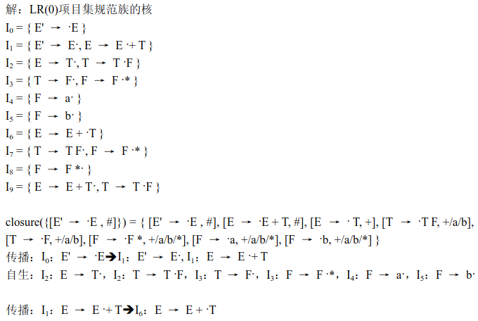
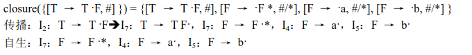
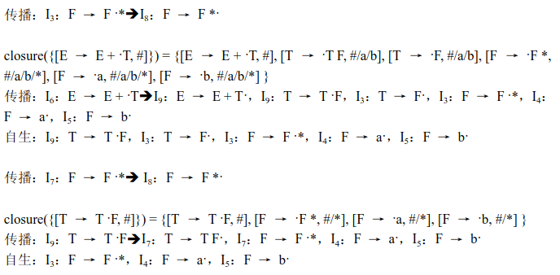
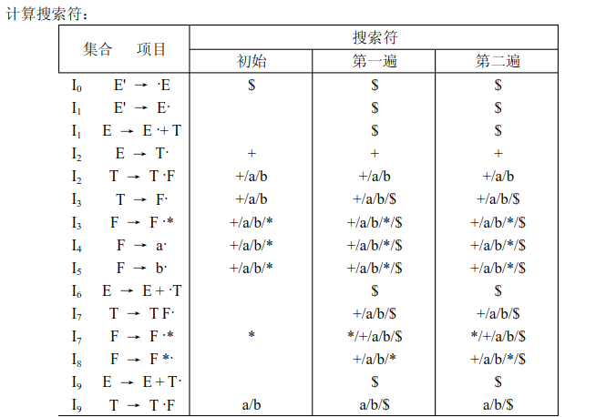
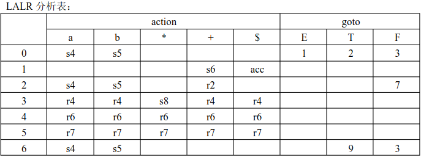
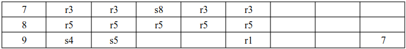

### 构造LR(1)分析表
构造LR(1)项目，然后建表的过程同 SLR(1)

如何构建LR(1)项目，最大难点其实就在向前搜索符等于多少？我总结了以下几点：
- `S'->S,$`这个一定是$
- 只有$$I_i$$项目之内，遇到$$A->α·Bβ$$时搜索符才会变化（上一条是$$A->α·Bβ，X$$，则搜索符变为`first(βX)`），如果·后移只是遇到了终结符，搜索符同前一条产生式的搜索符
- 如果是由$$I_i$$项目到$$I_j$$项目，第一条产生式·后移，无论遇不遇的非终结符，搜索符同$$I_i$$项目中对应的搜索符（即搜索符不发生改变）

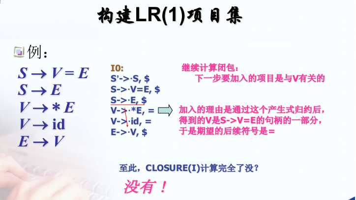
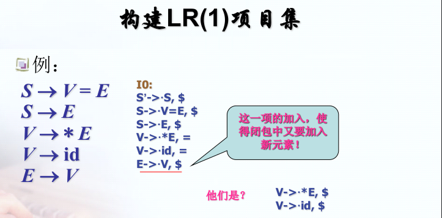

>见书P105 第3.24

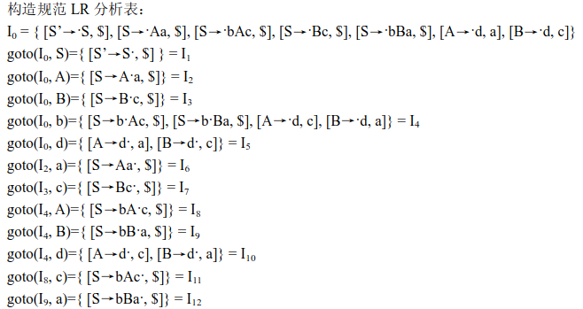

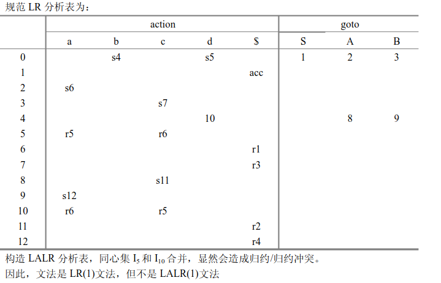

### 综合案例（LR(0)、SLR、LR(1)分析表、LALR(1)分析表）

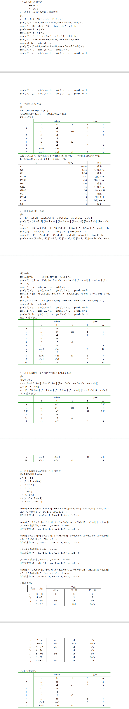

## LL(1) 和 SLR(1)
> P105 3.21

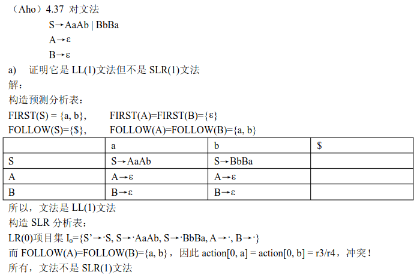

## LALR(1) 和 SLR(1)
> P105 3.22

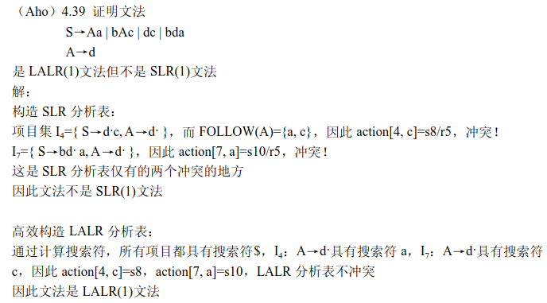

## LR(1)和LALR
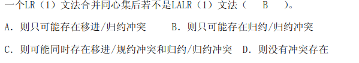

# 语义分析
```
综合属性、继承属性
S属性定义
注释分析树、属性依赖图
S属性定义的自下而上计算、栈操作
L属性定义
语法制导定义
翻译方案
L属性定义的自上而下计算
L属性定义的自下而上计算
```
## 语法制导定义和翻译方案
> P133 4.14
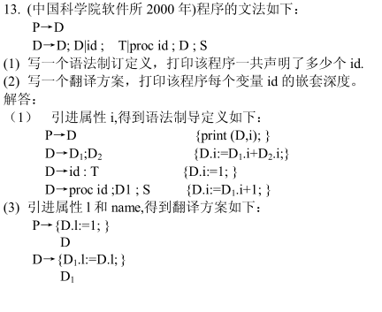
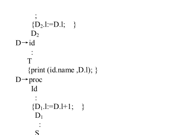

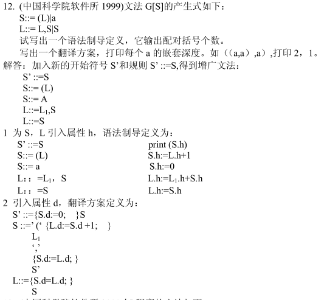

# 运行时的存储空间管理
```
内存划分
全局存储分配策略
字节对齐、衬垫空白区
活动树
控制栈
运行栈
活动记录
悬空引用
过程调用序列
过程返回序列
嵌套深度
静态链、访问链
动态链、控制链
静态作用域
动态作用域
值调用、引用调用、换名调用
```
- 静态链（访问链）和动态链（控制链）的作用？以及存了什么值？
> 静态链是指向**静态直接外层**最新活动记录地址的指针，作用是用来访问非局部数据；动态链是指向**调用该过程前的**最新活动记录的指针。作用是运行时使运行栈上个数据区按动态建立次序结成链


# 中间代码生成

```
后缀表示
图形表示
三地址代码
```