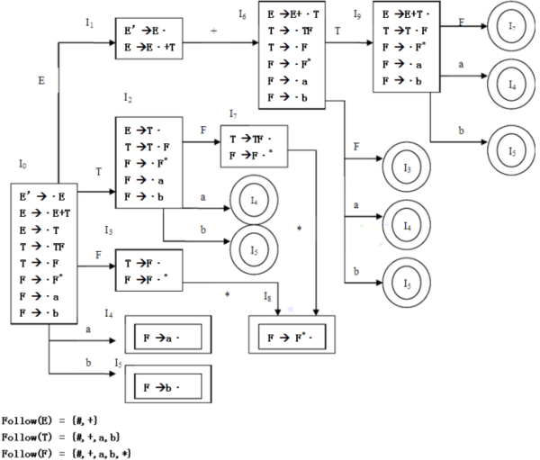

# 编译原理笔记

## 构造SLR(1)分析表
> 见P105习题3的第19题

1. 先分析扩广文法
2. 根据扩广文法得出LR(0)项目集规范簇 C ={I1，I2，...，In}，就是分析出In来
3. 根据In提取出action和goto
  1. 像goto(I0，E) = I1，就对应goto表中第0行第E列，值为1
  2. action(I0，a)  = I4，对应action表中第0行第a列，值为S4。和1不同的是a是终结符，E是非终结符
  3. 像I2中的E->T·，要action(I2，ａ) = r2，ａ＝Follower(E)={$,+}，即在第２行的$/+列，值都是r2，这个r2是因为生成式第二个就是Ｅ->T
4. 注意特殊的一个E'->E·，对应第１行的$列为acc
  
