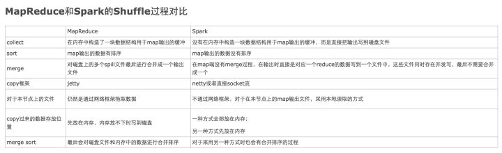

### Spark调优怎么做？

- 平台层面

选择高效的存储形式，如parquet；提高数据的本地性；防止不必要的jar包分发

- 应用程序层面

进行缓存复用RDD；处理数据倾斜；作业并行化执行；过滤操作符的优化降低过多小任务，降低单条记录的资源开销

- JVM层面

设置合适的资源量，设置合理的JVM，启用高效的序列化方法如kyro

### Spark自带的几个服务的端口

- 8080：Web UI的端口
- 4040：Job监控端口
- 18080：Job History端口

###  master 和 worker 通过什么方式进行通信

Spark的Master和Worker通过akka的actor方式进行通信，会产生定时的心跳任务，检查超时的worker

### cache后面能不能接其他算子,它是不是action操作？

可以接，但接了就实现不了缓存的作用了。不是action操作

### RDD弹性分布式数据集，弹性表现在哪些方面？

- 自动进行内存和磁盘的存储切换
- 基于DAG图和Lineage血统的高效容错
- task如果失败会自动进行特定次数的重试
- stage如果失败会自动进行特定次数的重试，而且只会计算失败的分片
- checkpoint和persist，数据计算之后持久化缓存
- 数据调度弹性：DAG TASK调度和资源无关
- 数据分片的高度弹性，分片有很多碎片可以合并成较大分片

### RDD缺陷

- RDD的写和更新操作都是**粗粒度**的（粗粒度，就是为了提高效率而批量写入数据），读操作可以是粗粒度或细粒度（一条一条的读）
- 不支持增量迭代计算

### Spark Shuffle过程如何理解？

- 过程划分
- 中间结果如何存储
- 数据如何拉取

http://www.cnblogs.com/jxhd1/p/6528540.html

### MapReduce 和 Spark中Shuffle有何异同？

1、MapReduce在Map阶段完成之后数据会被写入到内存中的一个环形缓冲区（后续的分区/分组/排序在这里完成）；Spark的Map阶段完成之后直接输出到磁盘。
2、受第一步的影响，MapReduce输出的数据是有序的（针对单个Map数据来说）；Spark的数据是无序的（可以使用RDD算子达到排序的效果）。
3、MapReduce缓冲区的数据处理完之后会spill到磁盘形成一个文件，文件数量达到阈值之后将会进行merge操作，将多个小文件合并为一个大文件；Spark没有merge过程，一个Map中如果有对应多个Reduce的数据，则直接写多个磁盘文件。
4、MapReduce全部通过网络来获得数据；对于本地数据Spark可以直接读取
5、就是上图剩下的步骤。。。

参考：https://www.zhihu.com/question/27643595/answer/125494852

### join操作该如何优化？

join分为两类：map-side join（Map端join）、reduce-side join（Reduce端join）

### 对于Spark中的数据倾斜问题你有什么好的方案？

1）前提是定位数据倾斜，是OOM了，还是任务执行缓慢，看日志，看WebUI
2)解决方法，有多个方面
· 避免不必要的shuffle，如使用广播小表的方式，将reduce-side-join提升为map-side-join
·分拆发生数据倾斜的记录，分成几个部分进行，然后合并join后的结果
·改变并行度，可能并行度太少了，导致个别task数据压力大
·两阶段聚合，先局部聚合，再全局聚合
·自定义paritioner，分散key的分布，使其更加均匀
详细解决方案参考博文[《Spark数据倾斜优化方法》](http://mp.weixin.qq.com/s?__biz=MzIzNzI1NzY3Nw==&mid=2247484221&idx=1&sn=7e20f08bfb490b91f0920aefb29ca271&chksm=e8ca159fdfbd9c89f610dd230e07f414521b4dd13018994ee9b873421d1e8efcdc535c810225&scene=21#wechat_redirect)

### Spark中数据位置管理——BlockManager

每个数据分片都要对应物理位置，由BlockManager管理（无论数据是在磁盘还是内存）

### 容错方式有几种类型？

- 通过lineage记录数据的更新，比较复杂且比较消耗性能，一个RDD出问题了可以依据它的依赖（lineage信息）来进行故障恢复，通常适合窄依赖，毕竟宽依赖是涉及多个父RDD。如果Lineage链较长，恢复可能很耗时
- 通过checkpoint。spark提供的一种缓存机制，为了避免重写计算某些RDD，而将**结果持久化到磁盘或hdfs**上。而且checkpoint时会清除所有依赖的父RDD的信息，所以checkpoint前要先persist下避免当前RDD重新计算（checkpoint会单独触发一个job来计算该RDD，所以缓存一下再checkpoint会快很多）。适合Lineage链很长、宽依赖的RDD

> checkpoint和cache区别：checkpoint是将中间结果持久化到磁盘或hdfs，job可以重新从checkpoint点开始计算。而cache缓存的数据由Executor管理，Executor消失的话cache数据也会没有，RDD需要重新计算

### 哪些地方会用到、需要用的persist？

- 某个步骤计算很耗时间，Lineage链很长的情况用persist
- checkpoint前使用persist
- shuffle之前框架会默认将数据persist到磁盘
- shuffle之后也要persist，因为shuffle要进性网络传输，风险很大，数据丢失重来，恢复代价很大

### Spark执行时会产生很多task的原因？如何写个默认task执行个数？

一般是很多个小文件造成的，一个输入block就会对应一个task。

可以修改默认配置文件spark-default.conf

1. spark.default.parallelism 10
2. spark.sql.shuffle.partitions 50 【针对spark sql】

***

- hive 的元数据存储在 derby 和 MySQL 中有什么区别? 多会话

- **reduceByKey不是Action操作，reduce是Action操作**

Master 的 **ElectedLeader 事件**后做了哪些操作 (D )
A. 通知 driver B.通知 worker 
C.注册 application D.直接 ALIVE

> ElectedLeader事件是啥？

数据本地性？什么环节确定的？

> DAG划分stage时确定

### Spark的数据本地性有几种？

- process_local：读取缓存在本地节点的数据
- node_local：读取本地节点磁盘上的数据
- any：读取非本地节点数据

通常读取数据PROCESS_LOCAL>NODE_LOCAL>ANY，尽量使数据以PROCESS_LOCAL或NODE_LOCAL方式读取

 	 

### 尽量少用groupByKey

少使用groupByKey，而选择reduceByKey。

reduceByKey适合大数据量，它会预先在本地机器上通过reduceByKey中的lambda函数参数对相同的key做reduce计算，然后在对不同分区上相同的key再次调用lambda函数做reduce计算。

而groupByKey只会将所有k-v对移动，一来网络数据传输成本加大了，二来为了确定k-v对移动到那台机器上去，会对key调用分区算法，当移动的数据量大于单台执行机器内存总量时 Spark 会把数据保存到磁盘上。 不过在保存时每次会处理一个 key 的数据，所以当单个 key 的键值对超过内存容量会存在内存溢出的异常

***

### Spark中Shuffle类算子有哪些？

#### 聚合类算子

reduceByKey、groupByKey、aggregateByKey、combineByKey

groupByKey返回`（K，Iterable <V>）`，reduceByKey传入一个函数参数返回`（K，V）`

都可以传入自定义的分区器参数Partitioner

#### 其余

- 去重
  - distinct
- 排序
  - sortBy
  - sortByKey
- 重分区
  - repartition
  - coalesce
- 集合
  - intersection
  - subtract
  - subtractByKey
- join

理论上，能不Shuffle操作就不要涉及Shuffle