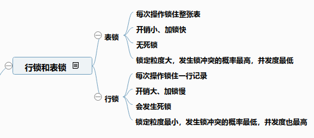
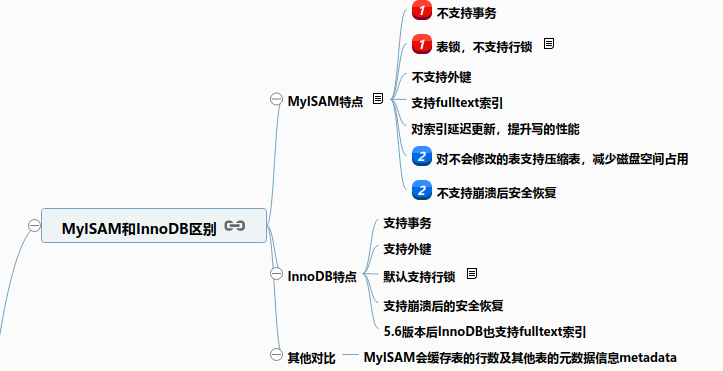
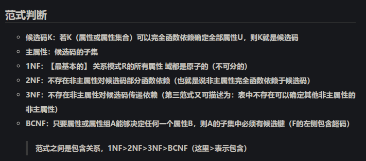

关系数据库规范化是为了解决关系数据库插入、删除和数据冗杂问题而引入的

### 什么是事务

事务是数据库**并发控制的单位**，要么都执行成功，要么都失败退出，是一个不可分割的工作单位，用来**保证系列操作后数据的一致性**

有ACID四大特性

[详细内容可参考](https://blog.csdn.net/zdwzzu2006/article/details/5947062)

> 有的会聊到InnoDB、MyISAM上去，后者不支持事务
>
> 有可能会问如何保证原子性（undo日志）、持久性（redo）、隔离性（锁）

### 什么是 脏读、不可重复读、幻读

1、脏读(DirtyReads)：所谓脏读就是对脏数据（Drity Data）的读取，而脏数据所指的就是未提交的数据。一个事务正在对一条记录做修改，在这个事务完成并提交之前，这条数据是处于待定状态的（可能提交也可能回滚），这时，第二个事务来读取这条没有提交的数据，并据此做进一步的处理，就会产生未提交的数据依赖关系。

2、不可重复读(Non-RepeatableReads)：一个事务先后读取同一条记录，期间另一个事务修改了数据，并且已经commit，所以两次读取的数据不同，称之为不可重复读。

3、幻读(PhantomReads)：一个事务先后读取同一个表，期间其他事务插入了新的数据，并且已经commit，这种现象就称为幻读。
它和不可重复读的区别：不可重复读的重点是修改，幻读重点是新增和修改。

[来源：掘金](https://juejin.im/post/5b2a006c51882574b55e562e)

### 隔离级别

隔离性就是用来解决上述脏读、不可重复读、幻读

| 隔离级别        | 脏读 | 不可重复读 | 幻读 | 加锁读 |
| --------------- | :--: | ---------- | ---- | ------ |
| READ UNCOMMITED | Y | Y | Y | N |
| READ COMMITED   | N | Y | Y | N |
| REPEATABLE READ | N | N | Y | N |
| SERILIZABLE     | N | N | N | Y |

> READ UNCOMMITTED级别最低，SERIALIZABLE级别最高。 级别越高肯定对于维护事务的四个特性就越好，但是它牺牲的是数据库的效率，因为SERIALIZABLE的实现是类似于java中的线程锁
>
> 
>
> MYSQL默认的是 REPEATABLE READ,事务默认自动提交，若想开启事务，使用set autocommit 命令

### 行锁和表锁、乐观锁和悲观锁

**悲观锁**：对并发冲突保持悲观态度，**强调只有获取锁才能访问数据**

> 会增加很多额外的开销，也增加了死锁的几率。尤其是对于读操作，不会修改数据，使用悲观锁大大增加系统的响应时间

传统数据库就是采取悲观锁

**乐观锁**：认为并发冲突发生的可能性低，所以采取最后提交数据时才获取锁

> 死锁的几率比较低，但是如果有多个事务同时处理相同数据也有几率会冲突甚至导致系统异常

### 存储引擎InnoDB和MyISAM

### 索引

#### 索引作用及优缺点？

索引就是数据库中一种加快数据检索和表连接的数据结构，提高系统的性能，但对于插入、删除、更新等任务而言也要修改索引，需要额外的I/O处理，所以会降低这类任务的速度。其次，索引还要占用额外的空间

#### 索引一定能提高查询的性能吗？

理论上确实是的，但不一定。深入浅出MySQL中有“范围查询时，查询返回数据超过全表的30%不会走索引进行查询，而是全表扫描”。还有就是聊索引优化，比如说像性别这类只有两种选择的就不适合使用索引

#### B+索引和Hash索引区别？

1. hash索引只适合等值比较，=、!=、in这些。不能用于范围查询，因为有序的键值经过哈希后也没序了
2. 如果键值唯一的话，等值比较hash索引有绝对优势
3. hash索引不支持多列联合索引的最左匹配规则
4. B+树索引检索效率较平均，B树波动幅度大，hash索引在大量重复键值存在的适合因为hash碰撞的缘故效率极低

#### 为什么B+树适合作为索引结构而不是B树？

底层：B树是**有序数组+平衡多叉树**，B+树是**有序数组链表+平衡多叉树**

B+树叶子存储数据，空间占用低，而且链表是双向链表，修改效率快

B树适合随机检索，B+树同时支持随机和顺序检索

数据库索引采用B+树的主要原因是B树在提高了磁盘IO性能的同时并没有解决元素遍历的效率低下的问题。
正是为了解决这个问题，B+树应运而生。B+树只要遍历叶子节点就可以实现整棵树的遍历。而且在数据库中基于范围的查询是非常频繁的，而B树不支持这样的操作（或者说效率太低）

#### 索引使用注意项

- 对于联合索引，使用是遵循最左前缀原则，否则索引失效

  > 由于最左前缀原则，在创建联合索引时，索引字段的顺序需要考虑字段值去重之后的个数，较多的放前面。ORDERBY子句也遵循此规则

- 要避免冗杂索引，没意义

-  [在线打开](http://naotu.baidu.com/file/397f5be4bd76f152ceaba6b705b036cf?token=6c3c7a81d6f16f5b)

#### 索引分类及创建  [在线打开](http://naotu.baidu.com/file/397f5be4bd76f152ceaba6b705b036cf?token=6c3c7a81d6f16f5b)

1. 主键索引，添加primary key：`alter table User add primary key('id');`
2. 唯一索引，添加unique：`alter table User add unique('column');`
3. 普通索引，添加index：`alter table table_name add index index_name('column');`
4. 全文索引，添加fulltext：`alter table table_name add fulltext('column');`
5. 多列索引：`alter table table_name add index index_name('c1','c2'...);`

#### 索引优化

我看了几篇别人写的文章、《深入浅出mysql》后，画了张脑图可以参考  [在线打开](http://naotu.baidu.com/file/397f5be4bd76f152ceaba6b705b036cf?token=6c3c7a81d6f16f5b)

### 为什么InnoDB推荐使用自增主键？

1. 索引底层数据结构使用的是B+树，数据是按索引序列顺序存储在叶子节点上的
2. 当有新记录插入时，会根据其主键插入适当位置。当一个节点含有数据超过阈值时会调整B+树，开辟新的节点（页）
3. 如果使用自增主键，每次插入数据会按顺序添加到当前节点的后续位置。写满一页的话会新开一个页形成一个紧凑的索引结构。每次插入时不需要移动已有数据，效率高，也不会增加很多开销在维护索引上
4. 如果使用非自增主键，类似上面会按序随机插入，新纪录都要被插到现有索引页的中间某个位置，可能会移动叶子节点的数据。因为这些数据是存储在磁盘上的，增加了很多开销，同时频繁的移动、分页操作造成了大量的碎片，得到了不够紧凑的索引结构

### left join中on子句中删选条件和where中条件的差别

前几天看到这个问题，之前上学学数据库根本就没谈过这种问题。

join过程会产生临时中间表，left join会保留左表中的列对右表做联合操作（右表不匹配的列会以null代替），之前学的就是这些

然而，**on中的删选条件会先对表进行删选，再执行左连接**（不管on中的条件是否为真，都会返回左表中的列）；**where中的条件是在左连接执行完后对表进行删选**（这个就可能会把左表中的某些列过滤掉）

> 注意这适合外连接outer join，据其原因，我感觉是执行顺序，on优于where执行

### SQL执行顺序

(5)SELECT DISTINCT TOP(<top_specification>) <select_list>                      

(1)FROM <left_table> <join_type> JOIN <right_table> ON <on_predicate> 

> on 过滤又优先于 join 连接执行

(2)WHERE <where_predicate>

(3)GROUP BY <group_by_specification>

(4)HAVING <having_predicate>

(6)ORDER BY <order_by_list>

### **drop、delete**与**truncate**的区别

- drop是删除整张表，truncate是删除整张表的数据，但会保留表结构，delete多和where一起用来删除表中部分数据

- 执行速度：drop>truncate>delete，很好想吧，delete有先过滤查询的过程

- delete是DML语句，会放在rollback segment中可以回滚（操作会记录在日志中），只有事务提交后才会执行。drop、truncate是DDL语句，一操作就生效

详细可参考：[drop、truncate和delete的区别](https://blog.csdn.net/ws0513/article/details/49980547)

### 聊聊数据库三大范式

这个想当初学数据库时也烦的很啊，想想就是回忆！

1NF不可分割，2NF不存在部分函数依赖，3NF没有传递依赖。抽象得很吧，如下出自[学数据库时的笔记](<https://josonle.github.io/blog/2018-11-12-%E5%85%B3%E7%B3%BB%E6%95%B0%E6%8D%AE%E5%BA%93%E8%AE%BE%E8%AE%A1%EF%BC%88F-%E9%97%AD%E5%8C%85%E3%80%81%E5%80%99%E9%80%89%E7%A0%81%E6%B1%82%E8%A7%A3%E3%80%81%E8%8C%83%E5%BC%8F%E5%88%A4%E6%96%AD%E5%8F%8ABCNF%E5%88%86%E8%A7%A3%EF%BC%89.html/>)

### 你的项目使用什么数据库？数据库了解多少？聊下数据库索引的实现和非主键的二级索引

InnoDB中：

- 主键索引（聚集索引（一级索引）），叶子节点存的是整行数据，是密集索引
- 非主键索引（二级索引），叶子节点存的是主键的值（涉及回表操作），是稀疏索引

对MyISAM 来说, 主键索引和其他索引没有任何区别, 都是稀疏索引 , 表数据存储在独立的地方, 表数据和索引的分开的, 索引用地址指向表数据

<https://www.jianshu.com/p/642bc306b1d9>

[MySQL——索引实现原理](https://www.cnblogs.com/songwenjie/p/9415016.html)

### 如何判断一个查询sql语句是否使用了索引？

考虑两方面：一是用explain语句，二是聊聊什么情况下索引生效

### sql执行计划怎么查看？关注哪些字段？

explain + “对应sql语句”

- select_type字段：表示select查询的类型

- type字段：数据访问的操作类型，显示是否用到了索引

  > 性能从差到好排序：ALL, index, range, ref, eq_ref, const, system, NULL

- extra字段

  - Using where：查找使用索引时，需要回表查询
  - Using index：不需要回表，表明用到了覆盖索引
  - Using temporary：查询使用临时表，一般出现于排序, 分组和多表join的情况, 查询效率不高, 建议优化
  - Using filesort：用于查询数据结果集的排序操作，只能应用在单个表上 【多表需要Using temporary】

- 参考
  - 《深入浅出MySQL》18.1
  - [理解索引：MySQL执行计划详细介绍](<https://juejin.im/post/5b1243eff265da6e0b6ff277#heading-10>)

### MySQL的数据量和并发量有多大？量大后有什么影响，有考虑这些吗？

### SQL调优了解哪些？

