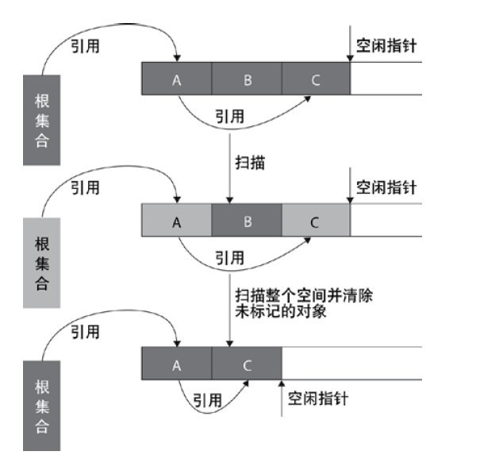
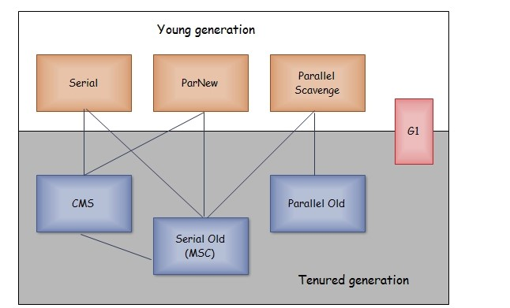

# Java集合

HashTable、HashMap、HashSet的时间复杂度O(1)，因为是散列函数，而TreeSet是基于红黑树的，时间复杂度是O(logn)

# JVM
## JVM运行时数据区域
- 程序计数器、java虚拟机栈、本地方法栈为线程私有，线程结束后这些区域也会消失，无需进行垃圾回收
- 堆、方法区（运行时常量池）为线程公有

记录几个常见问题：

- **只有程序计数器不会抛出异常**
- java虚拟机栈保存方法运行时栈帧（包含局部变量表、操作数栈、常量池引用、返回值等），随着方法运行入栈，方法退出出栈
  - 方法不断递归调用的话，线程请求的栈深度超过最大值，就会抛出 StackOverflowError 异常
  - 栈进行动态扩展时要是没有足够的内存，就会抛出OutOfMemoryError异常
  - 通过`-Xss`参数设置线程的java虚拟机栈内存大小
- 堆无需连续内存，且可动态增加内存，垃圾收集的主要区域，可通过`-Xms`、`-Xmx`参数设置程序堆内存初始值和最大值
- 方法区也无需连续内存，且可动态扩展内存。存放已加载的类信息、常量、静态变量、和编译后的代码等
  - 对这块区域进行垃圾回收的主要目标是**对常量池的回收和对类的卸载**，但是一般比较难实现
> HotSpot 虚拟机把它当成永久代来进行垃圾回收。但很难确定永久代的大小，因为它受到很多因素影响，并且每次 Full GC 之后永久代的大小都会改变，所以经常会抛出 OutOfMemoryError 异常。为了更容易管理方法区，从 JDK 1.8 开始，移除永久代，并把方法区移至元空间，它位于本地内存中，而不是虚拟机内存中。
> 
> 方法区是一个 JVM 规范，永久代与元空间都是其一种实现方式。在 JDK 1.8 之后，原来永久代的数据被分到了堆和元空间中。元空间存储类的元信息，静态变量和常量池等放入堆中

- 类卸载的三个前提条件（满足了也不一定会被卸载）
  - 该类的所有实例都已被回收
  - 加载该类的ClassLoader也被回收
  - 该类的Class对象没有在其他地方被引用

- 运行时常量池也会被放在方法区，在类被加载后放入该区域，也可以在运行时像String类的intern方法加入常量池。class字节码文件中的常量池指的是**编译器生成的字面量和符号引用**

- 对象是否可回收：引用计数法和可达性分析法
  - 可达性分析中的GC Roots可以是哪些对象：
    - java虚拟机栈中局部变量表引用的对象
    - 本地方法栈中JNI中引用的对象
    - 方法区中常量、类静态属性（就是静态变量）引用的对象
- 对象回收还和引用类型有关系
  - 强引用关联的对象不会被回收
  - 软引用关联的对象内存不足时才会被回收
  - 弱引用关联的对象只要进行垃圾回收就会被回收
  - 虚引用关联的对象

### 垃圾回收算法
- 标记-清除

之前看周志明的《深入理解java虚拟机》，书中给的图没有什么根集合，今天看到[深入理解java垃圾回收机制](https://www.cnblogs.com/sunniest/p/4575144.html)这篇博客时，才又有了新的理解和收获。上面提及的可达性算法的GC Roots也是在其他垃圾回收算法中要用到的。从根集合开始扫描，标记存活的对象，此为标记阶段。清除阶段，再次扫描，进行对象回收并取消回收对象的标志位，并将该分块连接到“空闲链表”的单向链表上。另外，还会判断回收后的分块与前一个空闲分块是否连续，如果连续会合并这两个分块

之后再次为对象分配空间时，也是遍历该空闲链表，寻找空间大于等于新对象大小 size 的块 block，然后会将块分割为size和blockSize-size大小的两块，返回大小为 size 的分块，并把大小为 (block - size) 的块返回给空闲链表，这就出现了内存碎片

> 效率低，内存碎片问题

- 标记-整理

标记阶段同标记-清除法，但整理阶段是把仍就存活的对象移向一端，然后清除端边界以外的内存
> 要移动大量对象，效率比标记-清除法更低，但没有内存碎片问题

- 复制算法

内存区分成两块同等大小的，每次用其中一块，回收对象时将存活对象复制到未使用的那一块，再清理使用过的内存空间
> 内存没完全利用

但像HotSpot虚拟机新生代中就用到了，Eden：Survivor1：Survivor2 = 8:1:1，每次利用Eden和其中一块Survivor区，内存空间利用率可达0.9。如果每次回收有多于 10% 的对象存活，那么一块 Survivor 就不够用了，此时需要依赖于老年代进行空间分配担保，也就是借用老年代的空间存储放不下的对象

- 分代回收
  - 新生代使用复制算法
  - 老年代考虑使用标记-清除或者标记-整理算法，因为老年代回收频率低

新生代
>[深入理解java垃圾回收机制](https://www.cnblogs.com/sunniest/p/4575144.html)
>1. 所有新生成的对象首先都是放在年轻代的。年轻代的目标就是尽可能快速的收集掉那些生命周期短的对象。
>2. 大部分对象在Eden区中生成，回收时先将Eden区存活对象复制到一个survivor1区，然后清空Eden区，当这个survivor1区也存放满了时，则将Eden区和survivor1区存活对象复制到另一个survivor2区，然后清空Eden和这个survivor2区，此时survivor1区是空的，然后将survivor2区和survivor1区交换，即保持survivor2区为空， 如此往复。
>3. 当survivor2区不足以存放Eden和survivor1的存活对象时，就将存活对象直接存放到老年代。若是老年代也满了就会触发一次Full GC，也就是新生代、老年代都进行回收。
>4. 新生代发生的GC也叫做Minor GC，MinorGC发生频率比较高(不一定等Eden区满了才触发)。

老年代
>1. 在年轻代中经历了N次垃圾回收后仍然存活的对象，就会被放到年老代中。因此，可以认为年老代中存放的都是一些生命周期较长的对象。
> 2. 内存比新生代也大很多(大概比例是1:2)，当老年代内存满时触发Major GC即Full GC，Full GC发生频率比较低，老年代对象存活时间比较长，存活率标记高

### 垃圾收集器

上图是HotSpot的7个垃圾收集器，连线表示可搭配使用