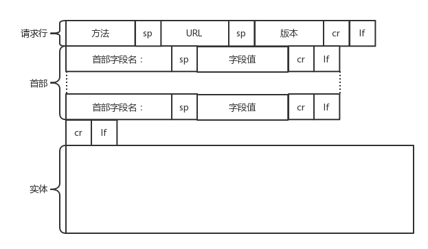

## 逻辑、应用数学

- 一个人在沙漠中车抛锚了，已知每天有车经过的概率是60%，问他在前8个小时获救的概率是多少？

> 每天是24h，三个8h。每天没车经过的概率是P^3=0.4（P是8h内没车的概率），解得P=0.74，所以获救概率1-P=0.26

- 五个海盗分100金币问题

> 这个真的是，没看过鬼才想得出啊，<https://blog.csdn.net/ELVIS8090/article/details/8292608>

- 8个西瓜，有一个轻一点，给一个天平问最少称几次可以找出轻的那个？

> 2次，分成三堆3、3、2

- 1到100少了一个数，如何快速判断少了哪个数？

> 可以遍历两次存起来判断缺了哪个。那这就不是要考的点了，1加到100是5050，加起来和5050相减就知道少了谁了

- C(A,B) = A!/(A-B)!*B!

  > C(2n,n)-C(2n,n-1)=C(2n,n)/(n+1) 
  >
  > 
  >
  > **入栈顺序ABCD，求有多少种可能的出栈顺序？**
  >
  > 注意入栈的同时是可以出栈的，满足卡特兰数，C(2n,n)/(n+1)
  >
  > > 推导：<https://blog.csdn.net/Zyearn/article/details/7758716>

## 计算机网络

- 了解UDP吗？UDP用来干啥？如何用UDP实现一个安全可靠的数据无丢失的视频通话

> udp用处：DNS、视频通话等
>
> 可靠的UDP：RUDP（Reliable UDP）了解一下，怎么实现？只能设置**重传机制**、缓存机制、计时器（后两者都是为了重传）
>
> 参考：[怎么让不可靠的 UDP 可靠？](https://infoq.cn/article/how-to-make-udp-reliable)

- 滑动窗口了解吗？客户端被告知服务端接收窗口为0怎么办？

> 服务器负载繁重，无法继续处理客户端发送的数据，就会发送窗口值为0的报文（TCP ZeroWindow）。此时，客户端停止传输数据，而是发送一个探测报文（TCP ZeroWindowProbe）。探测报文之后，一旦服务端能够再次处理数据就会回复非零窗口报文，以告知客户端现在可以接收数据的报文，客户端恢复传送数据
>
> 还有一种是，服务端滑动窗口出现空闲时，会主动发送TCP Window Update来更新发送方的滑动窗口

- 讲一下浏览器输入地址回车后干了什么

> HTTP协议，基于TCP。
>
> 1. 先通过DNS协议解析域名对应的IP地址（怎么个过程可以略讲下）
> 2. 先建立TCP连接，连接建立后发送HTTP请求。HTTP数据报加上TCP头，带上源/目的端口，再向下传输加上IP头，带上源/目的IP。
> 3. IP层先判断目的IP地址是否是和源IP地址属于同一局域网内
>    1. 是，通过ARP协议请求目的IP对应的MAC地址，然后把源/目的MAC放入MAC头，发出去即可
>    2. 不是，通过ARP协议请求网关的MAC地址，然后把源/网关MAC放入MAC头，将数据发送给网关。然后再由路由器取出目的IP，根据路由协议判断要发给的下一跳路由。同样是获取下一跳路由的MAC地址，依次一跳一跳发送到达目的IP所属的局域网，最后交付给目的IP。
> 4. 然后通过IP头判断上层协议是什么（UDP/TCP？）。然后解析TCP首部，判断ACK是否是自己需要的，不是的话扔弃。是的话，根据目的端口交付给HTTP服务器
> 5. web服务器会创建HTTP响应报文（含状态码），类似上面的流程返回给客户端
>
> HTTP请求报文
>
> 
>
> HTTP相应报文
>
> 
>
> 

## 操作系统

- 系统内存64MB，处理器32位，求虚地址空间为多少字节？

> 2^32次方=4G

- 7200rpm的磁盘的平均寻道时间？访问一个扇区的平均延迟时间？每个磁道包含 1000 个扇区，则存取时间？

> 存取时间 = 寻道时间 + 延迟时间 + 传输时间
>
> 平均寻道时间=60*1000 ms/7200 rpm=8.33ms，rpm单位是（转/分钟），平均延迟时间是半转寻道时间=4.17ms，传输时间是找到磁道上扇区的时间8.33/1000=0.01ms，所以总共12.5ms

- 进程和线程资源关系

线程占有的都是不共享的，其中包括：栈、寄存器、状态、程序计数器；
线程间共享的有：堆，全局变量，静态变量；
进程占有的资源有：地址空间，全局变量，打开的文件，子进程，信号量、账户信息。

- CPU用户态和内核态（系统态）

> 内核态只有中断、异常、系统调用时才会从用户态转为内核态
>
> 
>
> 考虑D可能发生除0异常，C可能发生缺页异常，A为中断，所以选B

- 32位CPU地址虚拟内存地址（虚拟地址）2^32B（即4GB，0~0xFFFFFFFF）,64位CPU为2^64B（0~0xFFFFFFFFFFFFFFFF）
  - 虚拟地址、逻辑地址、物理地址

## linux操作

主要问下常用哪些linux命令啊，了解哪些linux命令等，问会shell脚本吗等等

- 查找并杀掉某个进程

> 查找：`ps -ef | grep Name | grep -v grep`
>
> ` grep -v grep`表示不查找含grep的行
>
> 如下是找到网易云的进程
>
> 
>
> 杀进程：`kill -9 PID`，ps显示进程第2列就是PID
>
> ` ps -ef|grep cloud-music|grep -v grep|awk '{print $2,$8}'`，可以用awk命令来获取，像这条命令是获取输入的第二列和第八列
>
> 
>
> 
>
> 最终：kill -9 \`ps -ef|grep cloud-music|grep -v grep|awk '{print $2}'\`  即可。外层是Esc下面的那个引号，内层是单引号
>
> 
>
> 还有简单写法，用pgrep来查找进程的PID。试下 kill -9 \`pgrep cloud-music\`  

## 算法

- 0-1[背包问题](https://www.baidu.com/s?wd=%E8%83%8C%E5%8C%85%E9%97%AE%E9%A2%98&tn=SE_PcZhidaonwhc_ngpagmjz&rsv_dl=gh_pc_zhidao)可以用动态规划、回溯法和分支限界法这三种**任一**一种算法策略来求解

- 

> 选C，AVL树不一定是左小右大，也存在左大右小。排除法